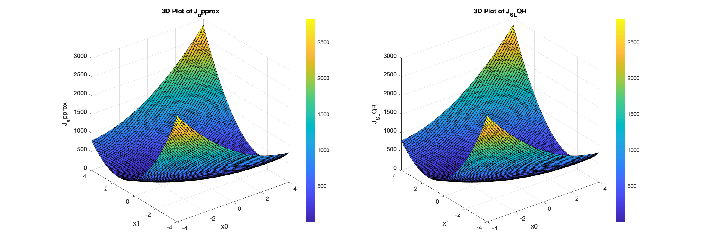
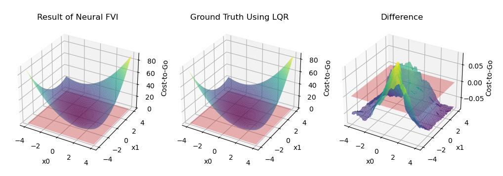
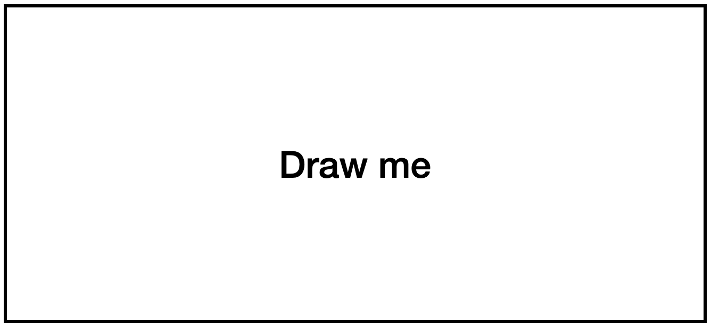

# Approximate Dynamic Programming {#approximatedp}

_Thanks to [Jiarui Li](https://jrli.org/) for contributing to this Chapter._

In Chapter \@ref(exactdp), we have studied two cases where dynamic programming (DP) can be executed exactly. Both cases are interesting yet limiting. 

In the linear quadratic regulator (LQR) case, the optimal controller is a linear controller and it does not require discretization of the state and control space. However, LQR only handles systems with linear dynamics.

In the Markov Decision Process (MDP) case, value iteration can obtain the optimal cost-to-go (or the optimal $Q$-value function) usually in a finite number of iterations. With barycentric interpolation, value iteration also leads to a practical controller for swinging up the pendulum (see Example \@ref(exm:pendulumvalueiterationbarycentric)), at least starting from some initial states. However, value iteration suffers from the _curse of dimensionality_, i.e., the amount of memory and computation needed to compute the optimal cost-to-go grows exponentially with the number of grids used to discretize the state space and control space. 

In this Chapter, we will study approximate dynamic programming, which aims to not find the optimal controller (simply because it is too demanding), but only a suboptimal controller that is perhaps good enough. It is worth noting that there exists a large amount of algorithms and literature for approximate DP, most of which are closely related to reinforcement learning, and studying all of them is beyond the scope of this course. In the following we will only go through several algorithmic frameworks that are representative.

<!-- Although we see in Example \@ref(exm:pendulumvalueiterationbarycentric) that value iteration with barycentric interpolation does stabilize the pendulum, we also realize that DP comes with 

The limitations of classical deterministic dynamic programming (DP) were mentioned in Chapter \@ref(formulation), particularly its inefficiency in fields such as robotics where both the state and control spaces are typically large and continuous. The process of discretization in such contexts is not only challenging but also costly. Even when discretization is achievable, the resultant state and control spaces tend to be extraordinarily vast and often high-dimensional, leading to prohibitive computational demands. This issue, commonly called the _curse of dimensionality_, renders the use of classical DP unfeasible. <span style="color:red">Add time complexity analysis here</span>. 
To circumvent the constraints of traditional DP algorithms in such contexts, a pragmatic approach involves the adoption of a suboptimal control scheme. This compromises between the ease of implementation and adequate performance. The principal objective of this chapter is to find such suboptimal control. In this chapter, we will spend most of the time discussing finite horizon problems with discrete state and control space, which is the classical scenario. We will also mention the infinite horizon problem and continuous state and control spaces scenario later. 

Broadly, two categories of approximation are used in the context of DP-based suboptimal control. The first is _approximation in value space_, where we aim to approximate the optimal cost function or the cost function of a given policy. The second is _approximation in policy space_, where we select the policy by using optimization over a suitable class of policies.  -->

## Fitted Value Iteration

Let us consider the infinite-horizon optimal control problem introduced in Chapter \@ref(infinite-horizon)
$$
\min_{\pi} \mathbb{E} \left\{ \sum_{k=0}^\infty g(x_k, \pi(x_k)) \right\}.
$$
Under some technical conditions, we know that the optimal policy is a deterministic and stationary policy and the optimal cost-to-go satisfies the following Bellman Optimality Equation
\begin{equation}
J^\star(x) = \min_{u \in \mathbb{U}} \mathbb{E}_w \left\{ g(x,u) + J^\star(f(x,u,w)) \right\}, \quad \forall x \in \mathbb{X}.
(\#eq:bellmanoptimality-fvi)
\end{equation}
From the plots in Example \@ref(exm:pendulumvalueiterationbarycentric), we observe that even for a "simple" problem like pendulum swing-up, the optimal cost-to-go $J^\star(x)$ does not look simple at all.

So here comes a very natural idea. What if we parametrize a cost-to-go function $\tilde{J}(x,r)$ by a vector of unknown coefficients $r \in \mathbb{R}^{d}$ and ask $\tilde{J}(x,r)$ to satisfy \@ref(eq:bellmanoptimality-fvi) as closely as possible?

This indeed leads to a valid algoithm called fitted value iteration (FVI). 

In FVI, we initialize the parameters $r$ as $r_0$ in the first step. Then, at the $k$-th iteration, we perform two subroutines. 

**Value update**. Firstly, we sample a large amount of points in the state space $\{x_k^s \}_{s=1}^q$, and for each $x_k^s$, we solve the minimization problem on the right-hand side of \@ref(eq:bellmanoptimality-fvi) using $J(x,r^{(k)})$ as the cost-to-go. Formally, this is 
\begin{equation}
\beta_k^s \leftarrow \min_{u \in \mathbb{U}} \mathbb{E}_w \left\{ g(x_k^s, u) + \tilde{J}(f(x_k^s,u,w),r^{(k)}) \right\}, \quad \forall x_k^s, s= 1,\dots,q.
(\#eq:fvi-step-one)
\end{equation}
This step gives us a list of scalars $\{ \beta_k^s \}_{s=1}^q$. If $\tilde{J}(x,r)$ indeed satisfies the Bellman optimality equation, then we should have
$$
\tilde{J}(x_k^s,r^{(k)}) = \beta_k^s, \quad \forall s = 1,\dots,q.
$$
This is certainly not true when the parameter $r$ is imperfect. 


**Parameter update**. Therefore, we will see the best parameter that minimizes the violation of the above equation
\begin{equation}
r^{(k+1)} \leftarrow \arg\min_{r \in \mathbb{R}^d} \sum_{s=1}^q \left(\tilde{J}(x_k^s,r) -  \beta_k^s\right)^2.
(\#eq:fvi-step-two)
\end{equation}
FVI essentially carries out \@ref(eq:fvi-step-one) and \@ref(eq:fvi-step-two) until some convergence metric is met.

Two challenges immediately show up:

- How to perform the minimization over $u$ in the first step \@ref(eq:fvi-step-one)? 

- How to find the best parameter update in the second step \@ref(eq:fvi-step-two)?

To solve the first challenge, we will assume that $\mathbb{U}$ is a finite set so that minimization over $u$ can be solved exactly. Note that this assumption is not strictly necessary. In fact, as long as $\mathbb{U}$ is a convex set and the objective in \@ref(eq:fvi-step-one) is also convex, then the minimization can also be solved exactly [@yang23arxiv-value]. However, we assume $\mathbb{U}$ is finite to simplify our presentation.

To solve the second challenge, we will assume $\tilde{J}(x,r)$ is _linear_ in the parameters $r$, as we will study further in the following. 

### Linear Features

We parameterize $\tilde{J}(x,r)$ as follows:
\begin{equation}
\tilde{J}(x,r) = \sum_{i=1}^d r_i \cdot \phi_i(x) = \begin{bmatrix} \phi_1(x) & \cdots & \phi_d(x) \end{bmatrix} r = \phi(x)^T r,
\end{equation}
where $\phi_1(x),\dots,\phi_d(x)$ are a set of known basis functions, or _features_. Common examples of features include polynomials and radial basis functions.
With this parametrization, the optimization in \@ref(eq:fvi-step-two) becomes 
\begin{equation}
\min_{r \in \mathbb{R}^d} \sum_{s=1}^q \left( \phi(x_k^s)^T r - \beta_k^s \right)^2,
(\#eq:fvi-step-two-least-squares)
\end{equation}
which is a least-squares problem that can be solved in closed form. In particular, we can compute the gradient of its objective with respect to $r$ and set it to zero, leading to
\begin{align}
0 = \sum_{s=1}^q 2(\phi(x_k^s)^T r - \beta_k^s ) \phi(x_k^s)  \Longrightarrow \\
r = \left( \sum_{s=1}^q \phi(x_k^s) \phi(x_k^s)^T \right)^{-1} \left( \sum_{s=1}^q \beta_k^s \phi(x_k^s) \right).
\end{align}

Let us apply FVI with linear features to a linear system for which we know the optimal cost-to-go.

::: {.examplebox}
::: {.example #feature-double-integrator name="Fitted Value Iteration for Double Integrator"}
Consider the double integrator
$$
\ddot{q} = u.
$$
Take $x = [q;\dot{q}]$, we can write the dynamics in state-space form 
\begin{equation}
    \dot{x} = \begin{bmatrix}
    \dot{q} \\
    u
    \end{bmatrix} = 
    \begin{bmatrix}
        0 & 1 \\
        0 & 0 
    \end{bmatrix} x + \begin{bmatrix}
        0 \\
        1 \end{bmatrix} u
    (\#eq:double-integrator-dynamics)
\end{equation}
We use a constant time $h=0.01$ differentiation to convert the continuous-time dynamics into discrete-time:
$$
x_{k+1} = h \cdot \dot{x}_k + x_k = \begin{bmatrix} 1 & h \\ 0 & 1 \end{bmatrix} x_k + \begin{bmatrix} 0 \\ h \end{bmatrix} u_k.
$$

The goal is to regulate the system at $(0,0)$. To do so, we use a quadratic cost
$$
J(x) = \min \sum_{k=0}^{\infty} x_k^T Q x_k + u_k^T R u_k, \quad x_0 = x.
$$
with $Q = 0.1I_2$ and $R = 1$. 

In Chapter \@ref(exactdp), we learned how to use LQR to precisely calculate the cost-to-go function of these systems using the _Algebraic Recatti Equation_. Solving the ARE, we obtain
$$
S_{\mathrm{LQR}} = \begin{bmatrix} 27.1640 & 31.7584 \\ 31.7584 & 85.9510 \end{bmatrix}.
$$

Now we want to investigate if FVI can find the same matrix $S$. To do so, we parametrize
$$
\tilde{J}(x) = x^T S x = x^T \begin{bmatrix} S_1 & S_2 \\ S_2 & S_3 \end{bmatrix} x = \begin{bmatrix} x_1^2 & 2 x_1 x_2 & x_2^2 \end{bmatrix} \begin{bmatrix} S_1 \\ S_2 \\ S_3 \end{bmatrix}, 
$$
where $S$ only has three independent variables due to being symmetric. Do note that $\tilde{J}(x)$ is _linear_ in $S$, so the parameter update step can be solved in closed form. 

We now show that the value update step can also be solved in closed form. Suppose we choose $x_k$ as a sample, then the right-hand side of \@ref(eq:fvi-step-one) reads:
$$
\min_{u} x_k^T Q x_k + u^2 + (A x_k + B u)^T S^{(k)} (A x_k + B u),
$$
where $S^{(k)}$ is the value of $S$ at the $k$-th iteration. Clearly, the optimization problem above is a convex quadratic optimization and can be solved in closed form:
$$
u = - (1 + B^T S^{(k)} B) ^{-1} B^T S^{(k)} A x_k.
$$

Applying fitted value iteration on randomly sampled points mentioned above, we obtain the fitted $S$
$$
S_{\mathrm{FVI}} = \begin{bmatrix} 27.1640 & 31.7583 \\ 31.7584 & 85.9509 \end{bmatrix}.
$$

We can see that $S_{\mathrm{FVI}}$ almost exactly matches the groundtruth LQR solution $S_{\mathrm{LQR}}$.

You can play with the code [here](https://github.com/ComputationalRobotics/OptimalControlEstimation-Examples/blob/main/LQR_FVI_Example.m).

<!-- the cost-to-go in Fig. \@ref(fig:double-integrator-feature-example). The value iteration converges in 3000 iterations.
```{r double-integrator-feature-example, out.width='90%', fig.show='hold', fig.cap='Comparison between the result of feature-based FVI and ground truth', fig.align='center', echo=FALSE}

```
The S matrix calculated by the result of FVI is $S_1$, and $S_2$ is the solution to the Recatti Equation. We have
\begin{equation}
    S_1 = \begin{bmatrix}
        27.164022 & 31.758386 \\ 
        31.758386 & 85.950968 \end{bmatrix}, \quad
    S_2 = \begin{bmatrix}
        27.164022 & 31.758386 \\
        31.758386 & 85.950968 \end{bmatrix}
    \end{equation}
$S_1$ and $S_2$ are almost the same, which means that we obtained the optimal cost-to-go function using fitted value iteration. 
It is worth noting that the cost-to-go function in Linear Quadratic Regulator is also using the linear architecture mentioned above.
\begin{equation}
    J(x,S)=x^T S x = \operatorname{tr}(S x^T x)
\end{equation}
It is quadratic in $x$ but linear in $S$.  -->
:::
:::

### Neural Network Features

We have seen that simple quadratic features work for the LQR problem. For more complicated problems, we will need more powerful function approximators like neural networks.

When we parameterize $\tilde{J}(x,r)$ as a neural network, $r$ will be the weights of the neural network. We may still be able to solve the value update step if $u$ lives in a finite space. However, the parameter update step usually cannot be solved exactly and will need to rely on numerical algoithms such as gradient descent. 

Let us try neural FVI on the same double integrator problem.

<!-- The selection of features is frequently manually crafted, relying on human intellect, intuition, or experience, and can pose considerable challenges. The utilization of a neural network as the approximation architecture has emerged as a popular approach in recent years. In this context, the parameter $r_k$ may correspond to the weights of the neural networks. A diverse range of machine learning techniques can then be implemented to manage the training problem, steering the approximation toward the optimal value.

However, the optimization process of the weights is more difficult due to the non-convexity. According to the equation \@ref(eq:apprinv-dp), the $J_{k+1}$ is non-convex which makes the entire equation hard to optimize.  -->

::: {.examplebox}
::: {.example #NNbased-double-tegrator name="Neural Fitted Value Iteration for the Double Integrator"}
In this example, we will use neural network as the approximation of the cost-to-go function and conduct neural FVI on a double integrator. The dynamics of the double integrator has been introduced in example \@ref(exm:feature-double-integrator). We use a positive definite network to model the cost-to-go function
\begin{equation}
    J(x) = N(x)^T N(x),
\end{equation}
where $N(x)$ is a 3-layer Multi-Layer-Perceptron with ReLU activation. 

Using mini-batch learning plus Adam optimizer, we obtain the cost-to-go in Fig. \@ref(fig:double-integrator-NN-example) after 300 epochs of training. 
```{r double-integrator-NN-example, out.width='90%', fig.show='hold', fig.cap='Comparison between the result of NN-based FVI and ground truth', fig.align='center', echo=FALSE}

```
The figure shows that the approximation performance of NN is pretty good. Simulation experiments also shows that the corresponding controller could successfully regulate the system at $(0,0)$. 

You can see the code [here](https://github.com/ComputationalRobotics/OptimalControlEstimation-Examples/tree/main/Neural-FVI).
:::
:::

### Fitted Q-value Iteration
From the MDP Chapter we know there is an equivalent representation of the Bellman Optimality Equation by replacing the $J$ value function in \@ref(eq:bellmanoptimality-fvi) with the $Q$-value function $Q(x,u)$. In particular, with 
$$
J^\star(x) = \min_{u \in \mathbb{U}} Q^\star(x,u)
$$
substituted into \@ref(eq:bellmanoptimality-fvi), we obtain the Bellman Optimality Equation in $Q^\star(x,u)$:
\begin{equation}
Q^\star(x,u) =  g(x,u) + \mathbb{E}_w \left\{ \min_{u' \in \mathbb{U}} Q^\star(f(x,u,w),u') \right\}.
(\#eq:bellmanoptimality-fqi)
\end{equation}
We can then use the same idea to approximate $Q^\star(x,u)$ as 
$$
\tilde{Q}(x,u,r)
$$
with $r \in \mathbb{R}^d$ a parameter vector. By iteratively evaluating the right-hand side of \@ref(eq:bellmanoptimality-fqi), we obtain the algoithm known as _fitted $Q$-value iteration_ (FQI).  

For example, we can similarly adopt the linear feature parameterization and set
$$
\tilde{Q}(x,u,r) = \phi(x,u)^T r,
$$
where $\phi(x,u)$ is a known pre-selected feature vector. Then at the $k$-th iteration of FQI, we perform two subroutines.

**Value update**. We sample a number of state-control pairs $\{(x_k^s,u_k^s) \}_{s=1}^q$ and evaluate the right-hand side of the Bellman optimality equation \@ref(eq:bellmanoptimality-fqi):
\begin{equation}
\beta_k^s \leftarrow g(x_k^s,u_k^s) + \mathbb{E}_w \left\{ \min_{u' \in \mathbb{U}} \tilde{Q}(f(x_k^s,u_k^s,w),u',r^{(k)}) \right\}, \quad \forall s = 1,\dots,q.
(\#eq:fqi-value-update)
\end{equation}
Again, if $u$ lives in a finite space, or the minimization is convex, the above value update can be solved exactly.

**Parameter update**. We update the parameter vector using the updated values $\{ \beta_k^s \}_{s=1}^q$:
\begin{equation}
r^{(k+1)} \leftarrow \arg\min_{r \in \mathbb{R}^d} \sum_{s=1}^q \left( \tilde{Q}(x_k^s,u_k^s,r) - \beta_k^s \right)^2,
(\#eq:fqi-parameter-update)
\end{equation}
which is a least squares problem that can be solved in closed form.

Let us apply FQI to the same double integrator example.

::: {.examplebox}
::: {.example #fqidoubleintegrator name="Fitted Q-value Iteration for Double Integrator"}
Consider the same double integrator dynamics in Example \@ref(exm:feature-double-integrator).

From the LQR solution we know the optimal $Q$-value function is
\begin{align}
Q^\star(x,u) &= x^T Q x + u^T R u + (Ax + Bu)^T S (Ax + Bu) \\
&= \begin{bmatrix} x \\ u \end{bmatrix}^T 
\underbrace{\begin{bmatrix} A^T S A + Q & A^T S B \\
B^T S A & B^T S B + R \end{bmatrix}}_{M_{\mathrm{LQR}}} \begin{bmatrix} x \\ u \end{bmatrix},
\end{align}
where $M_{\mathrm{LQR}}$ is
$$
M_{\mathrm{LQR}} = \begin{bmatrix}
27.2640 & 32.0300 & 0.3176 \\
32.0300 & 86.6889 & 0.8627 \\
0.3176 & 0.8627 & 1.0086 
\end{bmatrix}.
$$

Let us apply FQI to see if we get the same solution. We parametrize 
\begin{align}
\tilde{Q}(x,u) &= \begin{bmatrix} x \\ u \end{bmatrix}^T \begin{bmatrix}
M_1 & M_2 & M_3 \\
M_2 & M_4 & M_5 \\
M_3 & M_5 & M_6 
\end{bmatrix} \begin{bmatrix} x \\ u \end{bmatrix} \\
&= \begin{bmatrix} x_1^2 & 2 x_1 x_2 & 2x_1 u & x_2^2 & 2x_2 u & u^2 \end{bmatrix} \begin{bmatrix} M_1 \\ M_2 \\ M_3 \\ M_4 \\ M_5 \\ M_6 \end{bmatrix}.
\end{align}

At the $k$-th FQI iteration, we are given $M^{(k)}$. Suppose we sample $(x_k, u_k)$, then the value update step needs to solve \@ref(eq:fqi-value-update), which reads:
$$
\beta_k = g(x_k, u_k) + \min_{u'} \underbrace{\begin{bmatrix} A x_k + B u_k \\ u' \end{bmatrix}^T M^{(k)} \begin{bmatrix} A x_k + B u_k \\ u' \end{bmatrix}}_{\psi(u')}.
$$
The objective function $\psi(u')$ can be shown to be quadratic:
$$
\psi(u') = (Lu' + a_k)^T M^{(k)} (Lu' + a_k), \quad L = \begin{bmatrix} 0 \\ 1 \end{bmatrix}, a_k = \begin{bmatrix} A x_k + B u_k \\ 0 \end{bmatrix}.
$$
Therefore, we can solve $u'$ in closed-form
$$
u' = - (L^T M^{(k)} L)^{-1} L^T M^{(k)} a_k.
$$

Applying FQI with the closed-form update above, we get
$$
M_{\mathrm{FQI}} = \begin{bmatrix}
27.2640 & 32.0300 & 0.3176 \\
32.0300 & 86.6889 & 0.8627 \\
0.3176 & 0.8627 & 1.0086 
\end{bmatrix},
$$
which is exactly the same as the solution obtained from LQR.

You can play with the code [here](https://github.com/ComputationalRobotics/OptimalControlEstimation-Examples/blob/main/LQR_FQI_Example.m).
:::
:::

### Deep Q Network

Although we have only tested FVI and FQI on the simple double integrator linear system, these algoithms are really not so different from the state-of-the-art reinforcement learning algoithms. For example, the core of the seminal work Deep $Q$-Network (DQN) [@mnih15nature-dqn] is to use a deep neural network to parameterize the $Q$-value function. Of course the DQN work has used other clever ideas to make it work in practice, such as experience replay, but the essence is fitted $Q$-value iteration. 

You can find a good explanation of DQN in this [tutorial](https://www.tensorflow.org/agents/tutorials/0_intro_rl), and a practical step-by-step Pytorch implementation that [applies DQN on the cart-pole system](https://pytorch.org/tutorials/intermediate/reinforcement_q_learning.html). 


### Deep + Shallow 

Combine the rich features of DQN with the stable learning of FQI [@levine17neurips-shallow].


## Model Predictive Control

### Trajectory Optimization


#### Direct Collocation

Consider a continuous-time optimal control problem in full generality
\begin{equation} 
\begin{split}
\min_{u(t), t \in [0,T]} & \quad  g_T(x(T)) + \int_{t = 0}^T g(x(t),u(t)) \\
\text{subject to} & \quad \dot{x} = f(x(t),u(t)) \\
& \quad x(0) = x_0 \\
& \quad (x(t),u(t)) \in \mathcal{X} \times \mathcal{U} \\
& \quad \phi_i (x(t),u(t)) \geq 0, i=1,\dots,q.
\end{split}
(\#eq:constrained-optimal-control)
\end{equation}
where $g_T$ the terminal cost, $g$ the running cost, $x_0$ the initial condition, $\mathcal{X}$ the state constraint set, $\mathcal{U}$ the control constraint set, and $\{ \phi_i \}_{i=1}^q$ are general state-control constraints. We assume that the state constraint set $\mathcal{X}$ and control constraint set $\mathcal{U}$ can be described by a finite set of inequalities, i.e., 
$$
\mathcal{X} = \{x \in \mathbb{R}^n \mid c^x_i(x) \geq 0, i =1,\dots,q_x\}, \quad \mathcal{U} = \{u \in \mathbb{R}^m \mid c^u_i(u) \geq 0, i = 1,\dots,q_u \}.
$$
Assume that all functions are differentiable. 

_Direct collocation_, roughly speaking, is a set of techniques that transcribe the infinite-dimensional optimal control problem \@ref(eq:constrained-optimal-control) into a _nonlinear constrained optimization_ problem over finite-dimensional vectors. The key idea of direct collocation is to approximate the state trajectory $x(t)$ and the control trajectory $u(t)$ as piece-wise polynomial functions. In the following, we will describe the Hermite-Simpson collocation method.

**Time discretization**. We first discretize the total time window $[0,T]$ into a set of $N$ intervals:
$$
0 = t_0 \leq t_1 \leq \dots \leq t_k \leq t_{k+1} \leq \dots \leq t_N = T.
$$
We denote
$$
h_k = t_{k+1} - t_k
$$
as the length of the $k$-th time interval. As we will see, the length of the time interval does not need to be fixed, and instead they can themselves be unknown variables to be optimized (in which case the final time $T$ also becomes flexible). 

**Knot variables**. At each of the timestamps $t_0,\dots,t_N$, we assign _knot variables_, which are unknown state and control varaibles that need to be optimized. In particular, we have state knot variables
$$
x_k = x(t_k), k=1,\dots,N,
$$
and control knot variables
$$
u_k = u(t_k),k=0,\dots,N-1.
$$
As a result, the entire set of knot varaibles to be optimized is
\begin{equation}
v = \begin{bmatrix} u_0 \\ u_1 \\ \vdots \\ u_{N-1} \\ x_1 \\ x_2 \\ \vdots \\ x_{N} \end{bmatrix}.
(\#eq:knot-variables)
\end{equation}
If the time-discretization is also optimized, then $v$
<!-- $$
v = \begin{bmatrix} u_0 \\ u_1 \\ \vdots \\ u_{N-1} \\ x_1 \\ x_2 \\ \vdots \\ x_{N} \\ h_0 \\ \vdots \\ h_{N-1} \end{bmatrix}
$$ -->
includes the time intervals as well.

**Transcribe dynamics**. The most important step is to transcribe the nonlinear dynamics $\dot{x}=f(x(t),u(t))$ as constraints on the knot varaibles. In direct collocation, the way this is done is to enforce the dynamics equation at the set of _collocation points_ that are the mid-points between each consecutive pair of knot variables $(x_k, x_{k+1})$.

Specifically, in each subinterval $[t_k, t_{k+1}]$, we approximate the state trajectory as a cubic polynomial
\begin{equation}
x(t) = p_{k,0} + p_{k,1}(t-t_k) + p_{k,2}(t-t_k)^2 + p_{k,3}(t - t_k)^3, \quad t \in [t_k, t_{k+1}],
(\#eq:state-polynomial)
\end{equation}
where $p_{k,0},p_{k,1},p_{k,2},p_{k,3} \in \mathbb{R}^n$ are the coefficients of the polynomial. You would think that we would need to optimize the coefficients as well, but actually we won't need to, as will be shown soon.
With this parameterization, we can obtain the time derivative of $x(t)$ as 
\begin{equation}
\dot{x}(t) = p_{k,1} + 2 p_{k,2}(t-t_k) + 3p_{k,3}(t - t_k)^2, \quad t \in [t_k, t_{k+1}].
(\#eq:state-polynomial-derivative)
\end{equation}
Now the key step is to write the coefficients $p_{k,0},p_{k,1},p_{k,2},p_{k,3}$ using our knot variables \@ref(eq:knot-variables). To do so, we can invoke \@ref(eq:state-polynomial) and \@ref(eq:state-polynomial-derivative) to obtain
$$
\begin{bmatrix}
x_k \\
\dot{x}_k = f(x_k,u_k) \\
x_{k+1} \\
\dot{x}_{k+1} = f(x_{k+1}, u_{k+1})
\end{bmatrix}
= \begin{bmatrix}
I & 0 & 0 & 0 \\
0 & I & 0 & 0 \\
I & h_k I & h_k^2 I & h_k^3 I \\
0 & I & 2 h_k I & 3 h_k^2 I \end{bmatrix}
\begin{bmatrix}
p_{k,0}\\
p_{k,1}\\
p_{k,2}\\
p_{k,3}
\end{bmatrix}.
$$
Solving the above equation, we get 
\begin{equation}
\begin{bmatrix}
p_{k,0}\\
p_{k,1}\\
p_{k,2}\\
p_{k,3}
\end{bmatrix} = 
\begin{bmatrix}
I & 0 & 0 & 0 \\
0 & I & 0 & 0 \\
- \frac{3}{h_k^2} I & - \frac{2}{h_k} I & \frac{3}{h_k^2} I & -\frac{1}{h_k} I \\
\frac{2}{h_k^3} I & \frac{1}{h_k^2} I & -\frac{2}{h_k^3} I & \frac{1}{h_k^2} I 
\end{bmatrix}
\begin{bmatrix}
x_k \\
f(x_k,u_k) \\
x_{k+1} \\
f(x_{k+1}, u_{k+1})
\end{bmatrix}.
(\#eq:polynomial-coefficients-closed-form)
\end{equation}
Equation \@ref(eq:polynomial-coefficients-closed-form) implies, using the knot variables $v$ in \@ref(eq:knot-variables), we can query the value of $x(t)$ and $\dot{x}(t)$ at any time $t \in [0,T]$. In particular, we will query the values of $x(t)$ and $\dot{x}(t)$ at the midpoints to obtain
$$
x_k^c = x\left( t_k + \frac{h_k}{2} \right) = \frac{1}{2} (x_k + x_{k+1}) + \frac{h_k}{8} (f(x_k,u_k) - f(x_{k+1},u_{k+1})),
$$
and
$$
\dot{x}_k^c = \dot{x} \left( t_k + \frac{h_k}{2} \right) = - \frac{3}{2h_k} (x_k - x_{k+1}) - \frac{1}{4} \left( f(x_k,u_k) + f(x_{k+1},u_{k+1}) \right).
$$
At the midpoint, we assume the control is
$$
u_k^c = \frac{1}{2}(u_k + u_{k+1}).
$$
Therefore, we can enforce the dynamics constraint at the midpoint as 
\begin{equation}
\dot{x}^c_k = f(x_k^c, u_k^c).
(\#eq:collocation-constraint)
\end{equation}

**Transcribe other constraints**. The other constraints in the continuous-time formulation \@ref(eq:constrained-optimal-control) can be transcribed to the knot variables in a straightforward way:
\begin{align}
x_k \in \mathcal{X} \Rightarrow c_i^x(x_k)\geq 0, i=1,\dots,q_x, \quad k=1,\dots,N \\
u_k \in \mathcal{X} \Rightarrow c^u_i(u_k) \geq 0, i=1,\dots,q_u, \quad k=0,\dots,N-1\\
\phi_i(x_k, u_k) \geq 0, i=1,\dots,q, \quad k=0,\dots,N.
\end{align}

**Transcribe the objective**. We can write the objective as
$$
g_T(x_N) + \sum_{k=0}^{N-1} \frac{g(x_k,u_k) + g(x_{k+1},u_{k+1})}{2} h_k.
$$

**Summary**. In summary, the final optimization problem becomes 

\begin{equation} 
\begin{split}
\min_{u_0,\dots,u_{N-1},x_1,\dots,x_N} & \quad  g_T(x_N) + \sum_{k=0}^{N-1} \frac{g(x_k,u_k) + g(x_{k+1},u_{k+1})}{2} h_k \\
\text{subject to} & \quad \dot{x}_k^c = f(x_k^c,u_k^c), \quad k=0,\dots,N-1 \\
& \quad c_i^x(x_k) \geq 0,i=1,\dots,q_x, \quad k=1,\dots,N \\
& \quad c_i^u(u_k) \geq 0,i=1,\dots,q_u, \quad k=0,\dots,N-1 \\
& \quad \phi_i (x_k,u_k) \geq 0, i=1,\dots,q, \quad k=0,\dots,N.
\end{split}
(\#eq:constrained-optimal-control-nlp)
\end{equation}


<!-- ## Approximation in value space

Let us first recap the iteration process of the generic form of DP as mentioned in theorem \@ref(thm:dynamicprogramming). We can obtain the cost-to-go function $J_k$, which means the cost-to-go value at time $k$, thereby defining corresponding control $u_k$ or policy $\mu_k$. 

\begin{equation}
J_k(x_k) = \min_{u_k \in \mathbb{U}} \displaystyle \mathbb{E} \displaystyle \left\{ g_k(x_k,u_k) + J_{k+1}(f_k(x_k,u_k,w_k) ) \right\}, \ k=N-1,\dots,1,0.
\end{equation}

By using the _approximation in value space_ methods, we could replace the optimal cost-to-go function $J_k$ with some other functions $\tilde J_k$. In other words, the suboptimal policy $\tilde{\mu}_k(x_k)$ (and the corresponding control) is obtained from the one-step lookahead minimization

\begin{align}
\tilde{J}_k(x_k) &= \min_{u_k \in \mathbb{U}_k (x_k)} \displaystyle \mathbb{E} \displaystyle \left\{g_k(x_k,u_k,w_k) + \tilde J_{k+1} (f_k(x_k,u_k,w_k) ) \right\} \\
\tilde{\mu}_k(x_k) &= \arg \min_{u_k \in \mathbb{U}_k (x_k)} \displaystyle \mathbb{E} \displaystyle \left\{g_k(x_k,u_k,w_k) + \tilde J_{k+1} (f_k(x_k,u_k,w_k) ) \right\} (\#eq:apprinv-dp)
\end{align}

The major issue in value space approximation is how to compute the approximate cost-to-go functions $\tilde J_{k+1}$ in \@ref(eq:apprinv-dp). We will consider three types of methods: 

1. _Problem approximation_

2. _Parametric cost approximation_

3. _Online approximate optimization_

In approximation in value space, we may also distinguish between _online_ and _offline_ methods. 

1. _Offline_ methods, where the entire function $\tilde J_{k+1}$ in \@ref(eq:apprinv-dp) is computed for every $k$ before the control process begins. The advantage of this is that most of the computation is done offline. Once the control process starts, the only thing we have to do is one-step lookahead minimization. These methods are well-suited for settings where there are strict time constraints for the online computation of the control, and where there is no need for online replanning. 

2. _Online_ methods, where most of the computation is performed just after the current state $x_k$ becomes known, the values $\tilde J_{k+1}(x_{k+1})$ are computed only at the relevant next states $x_{k+1}$ and are used to compute $u_k$ via \@ref(eq:apprinv-dp). These methods require the computation of control only for the $N$ states actually encountered in the control process. These methods are well-suited for online replanning. 

### Problem Approximation

The functions $\tilde J_{k+1}$ are obtained (by exact DP, or other methods) as the optimal or nearly optimal cost functions of a simplified version of the original problem. The problem is how to simplify the problem, which is more convenient for computation. There are three widely-used approaches to simplify the initial problem: 

1. _Simplifying the structure of the problem through enforced decomposition_.

2. _Simplifying the probabilistic structure of the problem_, such as replacing the stochastic problem with a deterministic one by _certainty equivalence_. To be more specific, the original stochastic system contains the disturbance term $w_k(x_k,u_k)$. To simplify the probabilistic structure of the problem, we could fix the disturbances at some "typical" values and transform the stochastic problem into a deterministic one. 

3. _Aggregation_, where the original problem is approximated with a new problem with fewer states, makes it easier to obtain the cost-to-go function. The state in this new problem is the "combination" of the states in the initial problem. It is worth noting that the discretization of continuous state space and action space could be viewed as a kind of aggregation. 

### Parametric cost approximation

For discrete problems, it is natural to consider using the tabular method to represent the $\tilde J_k$ functions. However, if the number of the state space is large this method's memory cost will be overwhelming. On the other hand, for tabular representation, it is not convenient to optimize the function, while we can only update the value of _one_ state at a time, but in many circumstances, there is a cluster of states that have similar attributes, which means their corresponding $\tilde J_k$ are also similar. 
It is inconvenient to update them one by one. In this part, we will discuss an alternative approach to represent $\tilde J_k$ function, whereby $\tilde J_k$ are chosen to be members of a parametric class of functions, with the parameters "optimized" or "trained" by using some algorithms. 

To be more specific, the $\tilde J_k$ functions could be described as $\tilde J_k (x_k,r_k)$ that for each $k$, depend on the current state $x_k$ and a vector $r_k=(r_{1,k}, ..., r_{m,k})$ of $m$ "tunable" scalar parameters, also called _weights_. By adjusting the weights, one can change the "shape" of $\tilde J_k$ so that it is a reasonably close approximation to the true cost-to-go function $J_k$. 
In order to train those weights, we can use some cost functions to measure the accuracy of the approximation. The most common cost function is _least squares_. Training the parameters $r_k$ using least squares as the cost function is sometimes referred to as _fitted value iteration_. 
Value iteration could be viewed as a special form of dynamic programming, where the parameter vectors $r_k$ are determined sequentially, starting from the end of the horizon and proceeding backward. The algorithm samples the state space for each stage $k$ and generates a large number of states $x_k^s$, $s=1,...,q$. It then determines sequentially the parameter vectors $r_k$ to obtain a good "least square fit" to the DP algorithm. 

\begin{equation}
\beta_k^s=\min_{u \in \mathbb U_k(x_k^s)} E \displaystyle \left\{g(x_k^s,u,w_k) + \tilde J_{k+1} (f_k(x_k^s,u,w_k),r_{k+1}) \right\} (\#eq:apprinv-fvi-1)
\end{equation}
\begin{equation}
r_k = \arg \min_r \sum_{s=1}^q (\tilde J_k(x_k^s,r) - \beta_k^s)^2 (\#eq:apprinv-fvi-2)
\end{equation}

The next question is how to choose the most suitable class of functions, which is called _approximation architecture_. It is obvious that approximation architecture can greatly affect the performance of the approximation and the difficulty of training. The most popular architecture is _neural networks_, which are widely used in _reinforcement learning_, but the optimization process is difficult and the optimality is not guaranteed. We will start with a simpler linear feature-based approximation architecture. 

#### Linear feature-based architecture -->


<!-- ### Online approximate optimization

Different from previous sections, in this section, we will discuss _online_ approaches for computing the one-step lookahead control $u_k$ just after the current state $x_k$ becomes known. Here, to compute $u_k$, the values $\tilde J_{k+1} (x_{k+1})$ need only be computed at the relevant next states $x_{k+1}$ (the ones that can occur following application of $u_k$). 

A particularly effective online approach is _rollout_. In rollout algorithm, $\tilde J_{k+1}(x_{k+1})$ is calculated by a _suboptimal policy_, or _base policy_. $\tilde J_{k+1}$ could be calculated either analytically or by Monte Carlo simulation. This part is interconnected with _model predictive control (MPC)_, which we will also discuss at the end of this section. 

#### Rollout algorithm

The essence of the rollout is policy improvement, which generates a better policy on top of the base policy. In the rollout algorithm, $\tilde J_{k+1}$ is the cost-to-go of some known suboptimal policy $\pi = \{\mu_0,...,\mu_{N-1}\}$, referred to as _base policy_.
The policy $\bar \pi=\{\bar\mu_0,...,\bar\mu_{N-1}\}$ thus obtained is called the _rollout policy_ based on $\pi$. In short, _the rollout_ policy is the one-step lookahead policy, with the optimal cost-to-go approximated by the cost-to-go of the base policy_. 

**Definition 3.1 (One-step Rollout Algorithm)** We can get an improved policy from the base policy $\pi$

\begin{equation}
\bar\mu_k(x_k) = \arg\min_{u_k\in\mathbb U_k(x_k)} E\left\{g_k(x_k,u_k,w_k)+\tilde J_{k+1}(f_k(x_k,u_k,w_k))\right\} (\#eq:apprinv-rollout)
\end{equation}

where $\tilde J_{k+1}$ is the corresponding cost-to-go function of the base policy $\pi$. If we use $H_{k+1}$ to represent the cost-to-go function of the base policy $\pi$, the rollout algorithm will be: 

\begin{equation}
\bar\mu_k(x_k) = \arg\min_{u_k\in\mathbb U_k(x_k)} E\left\{g_k(x_k,u_k,w_k)+H_{k+1}(f_k(x_k,u_k,w_k))\right\} (\#eq:apprinv-rollout-2)
\end{equation}

In the control system, after the current state $x_k$ is revealed, we calculate the cost-to-go function $H_{k+1}$ of the known base policy $\pi$ and conduct one-step lookahead minimization to find $\bar\mu_k(x_k)$ and feed it into the system immediately. 

Note that it is also possible to define the rollout policy that makes use of multistep lookahead. While such multistep lookahead involves much more online computation, it will likely yield better performance than its one-step counterpart. In what follows, we concentrate on rollout policy with one-step lookahead. 

::: {.theorembox}
::: {.theorem #cost-improvement name="Cost improvement property of rollout algorithm"}
It is possible to show that the rollout policy's performance is no worse than the one of the base policy, while some special conditions must hold to guarantee this cost improvement property. Here we introduce the _sequential improvement_ condition. We say that the base policy has sequential improvement property if, for all $x_k$ and $k$, we have

\begin{equation}
\min_{u_k \in \mathbb U_k(x_k)} \left\{g_k(x_k,u_k)+H_{k+1}(f_k(x_k,u_k))\right\} \leq H_k(x_k)
\end{equation}

where $H_k(x_k)$ denotes the cost of the base policy starting from $x_k$. Here we use deterministic problems to make our proof concise. Sometimes people also use the _Q factor_ mentioned below: 

\begin{equation}
\tilde Q_k(x_k,u_k) = g_k(x_k,u_k)+H_{k+1}(f_k(x_k,u_k))
\end{equation}

so now the sequential improvement property could also be written as: 

\begin{equation}
\min_{u_k \in \mathbb U_k(x_k)} \tilde Q_k(x_k,u_k) \leq H_k(x_k)
\end{equation}

We will now show that the rollout algorithm obtained with a base policy with sequential improvement property yields no worse cost than the base policy. In particular, consider the rollout policy $\tilde \pi = \{\tilde \mu_0, ..., \tilde \mu_{N-1}\}$, and let $J_{k, \tilde \pi} (x_k)$ denote the cost obtained with $\tilde \pi$ starting from $x_k$. We claim that 

\begin{equation}
J_{k,\tilde \pi} (x_k) \leq H_k(x_k), for \ all \ x_k \ and \ k (\#eq:apprinv-cost-improvement)
\end{equation}
:::
:::
::: {.proofbox}
::: {.proof}
We prove this inequality by induction. Clearly it holds for $k=N$, since $J_{N,\tilde \pi} = H_N = g_N$. Assume it holds for index $k+1$. We have: 

\begin{align}
\tilde J_{k, \tilde \pi}(x_k) &= g_k(x_k, \tilde \mu_k(x_k)) + J_{k+1,\tilde \pi}(f_k(x_k, \tilde \mu_k(x_k))) \\
&\leq g_k(x_k, \tilde \mu_k(x_k)) + H_{k+1}(f_k(x_k, \tilde \mu_k(x_k))) \\ 
&= \min_{u_k \in \mathbb U_k(x_k)} \left[g_k(x_k,u_k) + H_{k+1} (f_k(x_k,u_k))\right] \\ 
&= \min_{u_k \in \mathbb U_k(x_k)} \tilde Q_k(x_k,u_k) \\
&\leq H_k(x_k)
\end{align}

where: 

a. The first equality is the DP equation for the rollout policy $\tilde \pi$. 

b. The first inequality holds by the induction hypothesis. 

c. The second equality holds by the definition of the rollout algorithm. 

d. The second inequality holds by the sequential improvement property. 

This completes the induction proof of the cost improvement property \@ref(eq:apprinv-cost-improvement). 

:::
:::

**Computational issues in rollout algorithms**. In the rollout algorithm, the cost-to-go function $H_{k+1}$ of the base policy is required to be computed online at all possible next states $f_k(x_k,u_k,w_k)$. However, the real-time constraint will be a critical problem, for the corresponding cost-to-go function of a given base policy is not easy to calculate in real-time. 
In most cases, we will use the approximate version of the cost-to-go $\tilde H_{k+1}$ to simplify the calculation. So the rollout algorithm will be: 

\begin{equation}
\bar\mu_k(x_k) = \arg\min_{u_k\in\mathbb U_k(x_k)} E\left\{g_k(x_k,u_k,w_k)+\tilde H_{k+1}(f_k(x_k,u_k,w_k))\right\} (\#eq:apprinv-rollout-3)
\end{equation}

There are two variants to handle the computational difficulties, deterministic case, and stochastic case. 

1. _Deterministic case_. If the problem is deterministic, the calculation is greatly simplified. 

2. _Stochastic case_. In these cases, the $\tilde H_{k+1}$ are evaluated online by Monte Carlo simulation for all $u_k \in \mathbb U_k(x_k)$. 

**Truncated rollout algorithm with multistep lookahead and terminal cost approximation**. We may incorporate multistep lookahead into the rollout framework. Let us start with a two-step lookahead for deterministic problems. Suppose that after $k$ steps we have reached state $x_k$. We then consider the set of all two-step-ahead states $x_{k+2}$, run the base policy starting from each of them, and compute the two-stage cost to get from $x_k$ to $x_{k+2}$, plus the cost of the base policy from $x_{k+2}$. We select the state, say $\tilde x_{k+2}$, that is associated with minimum cost, compute the controls $\tilde u_k$ and $\tilde u_{k+1}$ that lead from $x_k$ to $\tilde x_{k+2}$, and choose $\tilde u_k$ as the next rollout control and $x_{k+1}=f_k(x_k,\tilde u_k)$ as the next state. 

```{r multi-step-rollout, out.width='60%', fig.show='hold', fig.cap='Illustration of truncated rollout with two-step lookahead', fig.align='center', echo=FALSE}

```

The extension of the algorithm to lookahead of more than two steps is straightforward: instead of the two-step-ahead states $x_{k+2}$ we run the base policy starting from all the possible $l$-step ahead states $x_{k+l}$, etc. 

An important variation for problems with a large number of stages is _truncated rollout with terminal cost approximation_. Here the rollout trajectories are obtained by running the base policy from the leaf nodes of the lookahead tree, and they are truncated after a given number of steps, while a terminal cost approximation is added to the policy cost to compensate for the resulting error. One possibility that works well for many problems is to simply set the terminal cost approximation to zero. Alternatively, the terminal cost function approximation may be obtained by problem approximation or by using some sophisticated offline training process that may involve an approximation architecture such as a neural network. 

#### Model predictive control (MPC)

In this section, we will discuss a popular control algorithm called _model predictive control (MPC)_. We will start by considering the case where the objective is to keep the state close to the origin (or more generally some point of interest, called the _set point_, or _fixed point_); this is called the _regulation problem_. Similar approaches have been developed for the problem of maintaining the state of a non-stationary system along a given state trajectory, and also, with appropriate modifications, to control problems involving disturbances. In particular, in some cases, the trajectory is treated like a sequence of set points, and the subsequently described algorithm is applied repeatedly. 

We will consider a deterministic system

\begin{equation}
x_{k+1} = f_k(x_k,u_k)
\end{equation}

whose state $x_k$ and control $u_k$ are vectors that consist of a finite number of scalar components. The cost per stage is assumed nonnegative

\begin{equation}
g_k(x_k,u_k) \geq 0, for \ all \ (x_k,u_k)
\end{equation}

(e.g., a quadratic cost). We impose state and control constraints

\begin{equation}
x_k \in \mathbb X_k, u_k \in \mathbb U_k(x_k), k = 0,1,...
\end{equation}

We also assume that the system can be kept at the origin at zero cost, i.e., 

\begin{equation}
f_k(0,\bar u_k)=0,g_k(0,\bar u_k)=0 
\end{equation}

for some control $\bar u_k \in \mathbb U_k(0)$. This is a characteristic that all fixed points possess. 

For a given initial state $x_0 \in \mathbb X_0$, we want to obtain a sequence $\{u_0,u_1,...\}$ such that the states and controls of the system satisfy the state and control constraints with a small total cost. 

**The MPC algorithm**. Let us describe the MPC algorithm for the deterministic problem just described. At the current state $x_k$: 

1. MPC solves an $l$-step lookahead version of the problem, which requires that $x_{k+l}=0$. 

2. If $\{\tilde u_k, ..., \tilde u_{k+l-1}\}$ is the optimal control sequence of this problem, MPC applies $\tilde u_k$ and discards the other controls $\tilde u_{k+1}, ..., \tilde u_{k+l-1}$. 

3. At the next stage, MPC repeats this process, once the next state $x_{k+1}$ is revealed. 

In some literature, this MPC algorithm is also called _Receding Horizon Control_ algorithm, or RHC for short. One obvious drawback of this method is the online computation time limit. The MPC algorithm needs to solve an optimization problem online, which is time-consuming and does not guarantee a solution. 

To make the connection between MPC and rollout, we first recap the case of the truncated rollout algorithm. In a truncated rollout algorithm with multistep lookahead and terminal cost approximation, 

<!-- \begin{equation}
\min_{u_k \in \mathbb U_k(x_k), ..., u_{k+l} \in \mathbb U_{k+l}(x_{k+l})} \left\{\sum_{i=k}^{k+l} g_i(x_i, u_i) + \tilde H_{k+l+1} (x_{k+l+1}) \right\}
\end{equation} -->

<!-- \begin{equation}
\min_{u_k \in \mathbb U_k(x_k), ..., u_{k+l} \in \mathbb U_{k+l}(x_{k+l})} \left\{\sum_{i=k}^{k+l} g_i(x_i, u_i) + \sum_{i=k+l+1}^{k+l+m} g_i(x_i,\mu_i(x_i)) + \tilde J (x_{k+l+m+1}) \right\}
\end{equation}

such that

\begin{equation}
x_{i+1} = f_i(x_i,u_i)
\end{equation} -->

<!-- The control $u_k$ will be used as the control at step $k$ (online current step). All the $x_i$ are admissible states. Here $\tilde J$ means the terminal cost approximation, which can be obtained through offline computation or sometimes be set to zero. $l$ means the number of lookahead steps, and $m$ means the number of steps that the base policy runs to evaluate the cost-to-go function $H_{k+l+1}$. Let us discuss a special case, where the $\tilde J$ is set to zero while $m$ is also zero. So now the rollout algorithm becomes: 

\begin{equation}
\min_{u_k \in \mathbb U_k(x_k), ..., u_{k+l} \in \mathbb U_{k+l}(x_{k+l})} \sum_{i=k}^{k+l} g_i(x_i, u_i)
\end{equation} -->

<!-- while $u_k$ still be used as the current online control, and all other optimized controls are discarded. We can see that now it is _almost_ the case of model predictive control, without the terminal state constraint (in this case the terminal state constraint is $x_{k+l+1}=0$). This constraint is also called _recursive feasibility_, for it guarantees the optimization will not suddenly encounter a situation where the solver returns "infeasible". -->


## Policy Gradient

<!-- ## Approximation in policy space

A major alternative to approximation in value space is _approximation in policy space_, whereby we select the policy from a suitably restricted class of policies, usually a parametric class of some form. In particular, we can introduce a parametric family of policies

\begin{equation}
\mu_k(x_k,r_k), k=0,...,N-1
\end{equation}

where $r_k$ is a parameter, such as a family represented by a neural network, and then estimate the parameters $r_k$ using some type of optimization. 

An important advantage of approximation in policy space is that the computation of controls during the online operation of the system is often much easier compared with the lookahead minimization \@ref(eq:apprinv-dp). In this section, we will present two distinct approaches for computing $r$: _training by cost optimization_ and _training by using an expert_. 

### Training by using an expert

This approach is pretty similar to _supervised learning_ in machine learning. We $r_k$ by "training" on a large number of sample state-control pairs $(x_k^s, u_k^s), s=1, ... ,q$, such that for each $s$, $u_k^s$ is a "good" control at state $x_k^s$. This can be done for example by solving for each $k$ the least squares problem

\begin{equation}
\min_{r_k} \sum_{s=1}^q \left\Vert{u_k^s - \tilde \mu_k(x_k^s,r_k)}\right\Vert^2
\end{equation}

(possibly with added regularization). In particular, we may determine $u_k^s$ by a human or a software "expert" that can choose "near-optimal" controls at the given states $x_k^s$, so $\tilde{\mu}_k$ is trained to match the behavior of the expert. Of course, in the expert training approach, we cannot expect to obtain a controller that performs better than the expert with which it is trained. 

The "near-optimal" controls of sampled states $x_k^s, s = 1, ...,q$ could also be calculated from one-step lookahead minimization with a suitable approximation $\tilde{J}_{k+1}$. 

\begin{equation}
u_k^s = \arg \min_{u_k \in \mathbb{U}_k (x_k)} \displaystyle \mathbb{E} \displaystyle \left\{g_k(x_k^s,u_k,w_k) + \tilde J_{k+1} (f_k(x_k^s,u_k,w_k) ) \right\}
\end{equation}

### Training by cost optimization

POLICY GRADIENT

## Extension

It is possible for a suboptimal control scheme to employ both types of approximation: in policy space and in value space, with a distinct architecture for each case. This is known as the simultaneous use of a "policy network" (or "actor network") and a "value network" (or "critic network"), each with its own set of parameters. Simultaneous approximation in policy space and value space through the use of deep neural networks are central in AlphaGo and AlphaZero, DeepMind's Go and chess playing programs.  -->
