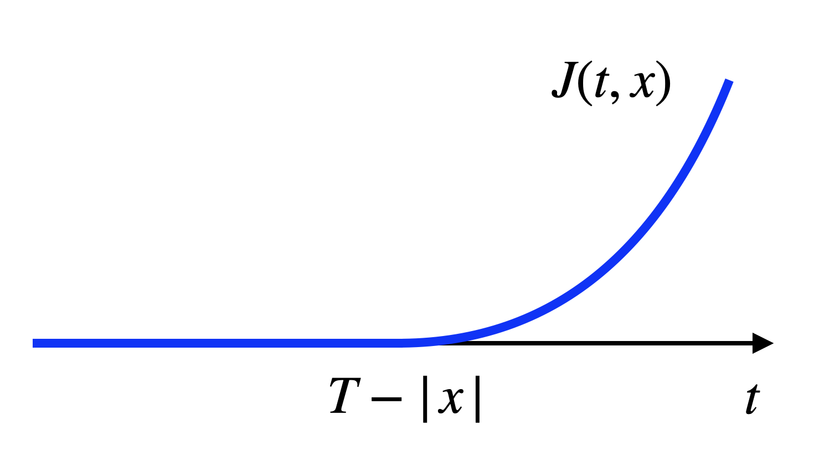
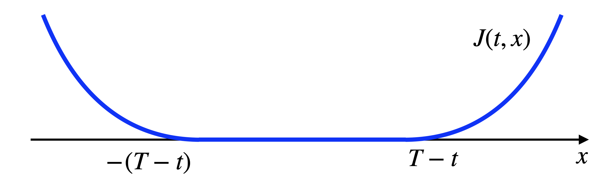

# Continuous-time Optimal Control {#continuous-time-optimal-control}

So far we have been focusing on stochastic and discrete-time optimal control problems. In this Chapter, we will switch gear to deterministic and continuous-time optimal control (still with continuous state and action space). 

The goal of a continuous-time introduction is threefold. (1) Real-world systems are natively continuous-time. (2) We will see the continuous-time analog of the Bellman principle of optimality in discrete-time (cf. Theorem \@ref(thm:bellmanoptimality)). (3) The continuous-time setup is more natural and popular for stability analysis to be introduced in Chapter \@ref(stability). 

## The Basic Problem

Consider a continuous-time dynamical system
\begin{equation}
\dot{x}(t) = f(x(t),u(t)),\ t \in [0,T], \quad x(0) = x_0,
(\#eq:ct-optimal-control-system)
\end{equation}
where 

- $x(t) \in \mathbb{R}^n$ is the state of the system,

- $u(t) \in \mathbb{U} \subseteq \mathbb{R}^m$ is the control we wish to design,

- $f: \mathbb{R}^{n} \times \mathbb{R}^m \rightarrow \mathbb{R}^n$ models the system dynamics, and 

- $x_0 \in \mathbb{R}^n$ is the initial state of the system.

We assume the admissible control functions $\{u(t) \mid u(t) \in \mathbb{U}, t\in [0,T] \}$, also called control trajectories, must be _piecewise continuous_.^[Even though we write $dx_i(t)/dt$ in the system \@ref(eq:ct-optimal-control-system), we allow $x(t)$ to be only directionally differentiable at a finite number of points to account for the possible discontinuity of $u(t)$.] For any control trajectory, we assume the system \@ref(eq:ct-optimal-control-system) has a unique solution $\{x(t)\mid t \in [0,T] \}$, called the state trajectory. 

We now state the continuous-time optimal control problem.

::: {.definitionbox}
::: {.definition #continuoustimeoptimalcontrol name="Continuous-time, Finite-horizon Optimal Control"}
Find the best admissible control trajectory $\{u(t) \mid t \in [0,T] \}$ that minimizes the cost function 
\begin{equation}
J(0,x_0) = \min_{u(t) \in \mathbb{U}} h(x(T)) + \int_0^T g(x(t),u(t)) dt,
(\#eq:ct-optimal-control-definition)
\end{equation}
subject to \@ref(eq:ct-optimal-control-system), where the functions $g$ and $h$ are continuously differentiable with respect to $x$, and $g$ is continuous with respect to $u$.
:::
:::

The function $J$ in \@ref(eq:ct-optimal-control-definition) is called the _optimal cost-to-go_, or the _optimal value function_. Notice that the optimal cost-to-go is a function of both the state $x$ and the time $t$, just as in the discrete-time case we used $J_k$ with a subscript $k$ to denote the optimal cost-to-go for the tail problem starting at timestep $k$ (cf. Theorem \@ref(thm:dynamicprogramming)). Specifically, we should interpret
$$
J(t,x_0) = \min_{u(t) \in \mathbb{U}} h(x(T)) + \int_t^T g(x(\tau),u(\tau)) d\tau, \quad x(t) = x_0,
$$
as the optimal cost-to-go of the system starting from $x_0$ at time $t$ (i.e., the tail problem).
We assume $J(0,x_0)$ is finite when $x_0$ is in some set $\mathcal{X}_0$.


## The Hamilton-Jacobi-Bellman Equation 

Recall that in discrete-time, the dynamic programming (DP) algorithm in Theorem \@ref(thm:dynamicprogramming) states that the optimal cost-to-go has to satisfy a recursive equation \@ref(eq:dpbackwardrecursion), i.e., the optimal cost-to-go at time $k$ can be calculated by choosing the best action that minimizes the stage cost at time $k$ plus the optimal cost-to-go at time $k+1$. In the next, we will show a result of similar flavor to \@ref(eq:dpbackwardrecursion), but in the form of a partial differential equation (PDE), known as the Hamilton-Jacobi-Bellman (HJB) equation. 

Let us informally derive the HJB equation by applying the DP algorithm to a discrete-time approximation of the continuous-time optimal control problem. We divide the time horizon $[0,T]$ into $N$ pieces of equal length $\delta = T/N$, and denote
$$
x_k = x(k\delta), \quad u_k = u(k \delta), \quad k = 0,1,\dots,N.
$$
We then approximate the continuous-time dynamics \@ref(eq:ct-optimal-control-system) as
$$
x_{k+1} = x_k + \dot{x}_k \cdot \delta = x_k + f(x_k,u_k) \cdot \delta,
$$
and the cost function in \@ref(eq:ct-optimal-control-definition) as 
$$
h(x_N) + \sum_{k=0}^{N-1} g(x_k, u_k)\cdot \delta.
$$
This problem now is in the form of a discrete-time, finite-horizon optimal control \@ref(def:basicproblem), for which we can apply dynamic programming. 

Let us use $\tilde{J}(t,x)$ (as opposed to $J(t,x)$) to denote the optimal cost-to-go at time $t$ and state $x$ for the discrete-time approximation. According to \@ref(eq:dpbackwardrecursion), the DP backward recursion is 
\begin{align}
\tilde{J}(N\delta,x) = h(x), \\
\tilde{J}(k\delta,x) = \min_{u \in \mathbb{U}} \left[ g(x,u)\cdot \delta + \tilde{J}((k+1)\delta,x + f(x,u)\cdot \delta)  \right], \quad k = N-1,\dots,0.
(\#eq:ct-optimal-control-discrete-approx-dp)
\end{align}
Suppose $\tilde{J}(t,x)$ is differentiable, we can perform a Taylor-series expansion of $\tilde{J}((k+1)\delta,x+f(x,u)\delta)$ in \@ref(eq:ct-optimal-control-discrete-approx-dp) as follows
$$
\tilde{J}((k+1)\delta,x+f(x,u)\delta) = \tilde{J}(k\delta,x) + \nabla_t \tilde{J} (k\delta,x) \cdot \delta + \nabla_x \tilde{J}(k\delta,x)^T f(x,u) \cdot \delta + o(\delta),
$$
where $o(\delta)$ includes high-order terms that approach zero when $\delta$ tends to zero, $\nabla_t \tilde{J}$ and $\nabla_x \tilde{J}$ (a column vector) denote the partial derivates of $\tilde{J}$ with respect to $t$ and $x$, respectively. Plugging the first-order Taylor expansion into the DP recursion \@ref(eq:ct-optimal-control-discrete-approx-dp), we obtain 
\begin{equation}
\tilde{J}(k\delta,x) = \min_{u \in \mathbb{U}} \left[ g(x,u) \cdot \delta + \tilde{J}(k \delta,x) + \nabla_t \tilde{J}(k \delta,x) \delta + \nabla_x \tilde{J}(k\delta,x)^T f(x,u) \delta + o(\delta)  \right].
(\#eq:ct-optimal-control-discrete-approx-taylor)
\end{equation}
Cancelling $\tilde{J}(k \delta,x)$ from both sides, dividing both sides by $\delta$, and assuming $\tilde{J}$ converges to $J$ uniformly in time and state, i.e., 
$$
\lim_{\delta \rightarrow 0, k\delta = t} \tilde{J}(k\delta,x) = J(t,x), \quad \forall t,x,
$$
we obtain from \@ref(eq:ct-optimal-control-discrete-approx-taylor) the following partial differential equation
\begin{equation}
0 = \min_{u \in \mathbb{U}} \left[ g(x,u) + \nabla_t J(t,x) + \nabla_x J(t,x)^T f(x,u)  \right], \quad \forall t, x,
(\#eq:hjb-informal)
\end{equation}
with the boundary condition $J(T,x) = h(x)$. Equation \@ref(eq:hjb-informal) is called the Hamilton-Jacobi-Bellman equation.

Our derivation above is informal, let us formally state the HJB equation.

::: {.theorembox}
::: {.theorem #hjbsufficient name="Hamilton-Jacobi-Bellman Equation as A Sufficient Condition for Optimality"}
Consider the optimal control problem \@ref(def:continuoustimeoptimalcontrol) for system \@ref(eq:ct-optimal-control-system). Suppose $V(t,x)$ is a solution to the Hamilton-Jacobi-Bellman equation, i.e., $V(t,x)$ is continuously differentiable and satisfies
\begin{align}
(\#eq:hjb-eqution-formal-1)
0 = \min_{u \in \mathbb{U}} \left[ g(x,u) + \nabla_t V(t,x) + \nabla_x V(t,x)^T f(x,u)\right], \quad \forall t,x, \\
V(T,x) = h(x), \quad \forall x.
\end{align}
Suppose $\mu^\star(t,x)$ attains the minimum in \@ref(eq:hjb-eqution-formal-1) for all $t$ and $x$. Let $\{x^\star(t) \mid t \in [0,T] \}$ be the state trajectory obtained from the given initial condition $x(0)$ when the control trajectory $u^\star(t) = \mu^\star(t,x^\star(t))$ is applied, i.e., $x^\star(0) = x(0)$ and for any $t \in [0,T]$, $\dot{x}^\star(t) = f(x^\star(t), \mu^\star(t,x^\star(t)))$ and we assume this differential equation has a unique solution starting at any $(t,x)$ and that the control trajectory $\{ \mu^\star(t,x^\star(t)) \mid t \in [0,T] \}$ is piecewise continuous as a function of $t$.
Then $V(t,x)$ is equal to the optimal cost-to-go $J(t,x)$ for all $t$ and $x$. Moreover, the control trajectory $u^\star(t)$ is optimal.
:::
:::

::: {.proofbox}
::: {.proof}
Let $\{\hat{u}(t) \mid t \in [0,T] \}$ be any admissible control trajectory and let $\hat{x}(t)$ be the resulting state trajectory. From the "$\min$" in \@ref(eq:hjb-eqution-formal-1), we know 
$$
0 \leq g(\hat{x},\hat{u}) + \nabla_t V(t,\hat{x}) + \nabla_x V(t,\hat{x})^T f(\hat{x},\hat{u}) = g(\hat{x},\hat{u}) + \frac{d}{dt} V(t,\hat{x}).
$$
Integrating the above inequality over $t \in [0,T]$, we obtain 
$$
0 \leq \left( \int_{0}^T g(\hat{x}(t),\hat{u}(t))dt \right) + V(T,\hat{x}(T)) - V(0,\hat{x}(0)).
$$
Using the terminal constraint $V(T,x) = h(x)$ for any $x$ and the initial condition $\hat{x}(0) = x(0)$, we have 
$$
V(0,x(0)) \leq h(\hat{x}(T)) + \int_{0}^T g(\hat{x}(t),\hat{u}(t)) dt.
$$
This shows that $V(0,x(0))$ is a lower bound to the optimal cost-to-go, because any admissible control trajectory $\hat{u}(t)$ leads to a cost no smaller than $V(0,x(0))$. 

It remains to show that $V(0,x(0))$ is attainable. This is done by plugging the optimal control trajectory $u^\star(t)$ and state trajectory $x^\star(t)$ to the derivation above, leading to
$$
V(0,x(0)) = h(x^\star(T)) + \int_0^T g(x^\star(t),u^\star(t)) dt.
$$
This shows that $V(0,x(0)) = J(0,x(0))$.

The argument above is generic and holds for any initial time $t \in [0,T]$ and initial state $x$. Therefore, $V(t,x) = J(t,x)$ is the optimal cost-to-go.
:::
:::

Theorem \@ref(thm:hjbsufficient) effectively turns the optimal control problem \@ref(eq:ct-optimal-control-definition) into finding a solution for the partial differential equation \@ref(eq:hjb-eqution-formal-1). Let us illustrate the theorem using a simple example.

::: {.examplebox}
::: {.example #hjbequationsimpleexample name="A Scalar System"}
Consider the following dynamical system
$$
\dot{x}(t) = u(t), \quad t \in [0,T]
$$
where $x \in \mathbb{R}$ is the state, and $u \in \mathbb{U} = [-1,1]$ is the control.

We are interested in the following optimal control problem
$$
\min_{u(t)} \frac{1}{2} \left( x(T) \right)^2,
$$
where the goal is to move the initial state as close as possible to the origin $0$ at the terminal time $T$.

There is a simple optimal controller for this scalar system. We move the state as quickly as possible to the origin $0$, using maximum control, and then maintain the state at the origin using zero control. Formally, this is 
$$
\mu^\star(t,x) = - \text{sgn}(x) = \begin{cases}
1 & \text{if } x < 0 \\
0 & \text{if } x = 0 \\
-1 & \text{if } x > 0
\end{cases}.
$$
With this controller, we know that if the system starts at $x$ at time $t$, the terminal state will satisfy
$$
\vert x(T) \vert = \begin{cases}
|x| - (T - t) & \text{if } T-t < |x|  \\
0 & \text{otherwise} 
\end{cases}.
$$
As a result, the optimal cost-to-go is
\begin{equation}
J(t,x) = \frac{1}{2} \left( \max\{0,  |x| - (T - t)\} \right)^2.
(\#eq:scalar-system-optimal-value)
\end{equation}

Let us verify if this function satisfies the HJB equation.

**Boundary condition**. Clearly, 
$$
J(T,x) = \frac{1}{2}x^2
$$
satisfies the boundary condition. 

**Differentiability**. When viewed as a function of $t$, $J(t,x)$ in \@ref(eq:scalar-system-optimal-value) can be plotted as in Fig. \@ref(fig:scalar-system-optimal-J-t). We can see that $J(t,x)$ is differentiable in $t$ and 
\begin{equation}
\nabla_t J(t,x) = \max\{ 0, |x| - (T-t) \}.
(\#eq:scalar-system-partial-J-partial-t)
\end{equation}
```{r scalar-system-optimal-J-t, out.width='50%', fig.show='hold', fig.cap='Optimal cost-to-go as a function of time.', fig.align='center', echo=FALSE}

```
When viewed as a function of $x$, $J(t,x)$ can be plotted as in Fig. \@ref(fig:scalar-system-optimal-J-x). We can see $J(t,x)$ is differentiable in $x$ and 
\begin{equation}
\nabla_x J(t,x) = \text{sgn}(x) \cdot \max\{ 0,|x| - (T-t) \}.
(\#eq:scalar-system-partial-J-partial-x)
\end{equation}

```{r scalar-system-optimal-J-x, out.width='60%', fig.show='hold', fig.cap='Optimal cost-to-go as a function of state.', fig.align='center', echo=FALSE}

```

**PDE**. Substituting \@ref(eq:scalar-system-partial-J-partial-t) and \@ref(eq:scalar-system-partial-J-partial-x) into the HJB equation \@ref(eq:hjb-eqution-formal-1), we need to verify that the followng equation holds for all $t$ and $x$
\begin{equation}
0 = \min_{u \in \mathbb{U}} (1 + \text{sgn}(x) \cdot u) \max\{0, |x| - (T-t) \}.
(\#eq:scalar-system-hjb)
\end{equation}
This is easy to verify as $u = - \text{sgn}(x)$ attains the minimum and sets the right-hand side equal to zero for any $(t,x)$.

However, we can observe that the optimal controller need not be unique. For example, when $|x| \leq T-t$, we have 
$$
\max\{0, |x| - (T-t) \} = 0,
$$
and any $u \in \mathbb{U}$ would attain the minimum in \@ref(eq:scalar-system-hjb) and hence be optimal.
:::
:::

## Linear Quadratic Regulator

## The Pontryagin Minimum Principle

The HJB equation in Theorem \@ref(thm:hjbsufficient) provides a _sufficient_ condition for the optimal cost-to-go. However, since the HJB equation is a sufficient condition, there do exist cases where the optimal cost-to-go does not satisfy the HJB equation but is still optimal (e.g., when the optimal cost-to-go is not continuously differentiable).

We now introduce a _necessary_ condition that any optimal control trajectory and state trajectory must satisfy. This condition is the celebrated Pontryagin minimum principle. 

A rigorous derivation of the Pontryagin minimum principle can be mathematically involving and is beyond the scope of this lecture notes (see Section 7.3.2 in [@bertsekas12book-dpocI] for a more rigorous treatment). In the following, we provide an informal derivation of the Pontryagin minimum principle.

Recall the HJB equation in Theorem \@ref(thm:hjbsufficient) states that, if a control trajectory $u^\star(t)$ and the associated state trajectory $x^\star(t)$ is optimal, then for all $t \in [0,T]$, the following condition must hold
\begin{equation}
u^\star(t) = \arg\min_{u \in \mathbb{U}} \left[ g(x^\star(t),u) + \nabla_x J(t,x^\star(t))^T f(x^\star(t),u)  \right] 
(\#eq:pmp-intro-from-hjb).
\end{equation}
The above equation says, in order to compute the optimal control, we do not need to know the value of $\nabla_x J$ at _all_ possible values of $x$ and $t$ (which is what the HJB equation tries to do), and we only need to know the value of $\nabla_x J$ along the _optimal_ trajectory, i.e., to know only $\nabla_x J(t,x^\star(t))$.

The Pontryagin minimum principle builds upon this key observation, and it points out that $\nabla_x J(t,x^\star(t))$ (but not $\nabla_x J(t,x)$ for any $x$) satisfies a certain differential equation called the _adjoint equation_. 

We now provide an informal derivation of the adjoint equation that is based on differentiating the HJB equation. Towards this goal, we first present the following lemma which is itself quite useful.

::: {.theorembox}
::: {.lemma #gradientofminimumfunctions name="Differentiating Functions Involving Minimization"}
Let $F(t,x,u)$ be a continuously differentiable function of $t \in \mathbb{R}$, $x \in \mathbb{R}^n$, $u \in \mathbb{R}^m$, and let $\mathbb{U}$ be a convex subset of $\mathbb{R}^m$. Suppose $\mu^\star(t,x)$ is a continuously differentiable function such that 
$$
\mu^\star(t,x) = \arg\min_{u \in \mathbb{U}} F(t,x,u), \quad \forall t,x.
$$
Then 
\begin{align}
\nabla_t \left\{ \min_{u \in \mathbb{U}} F(t,x,u) \right\} = \nabla_t F(t,x,\mu^\star(t,x)), \quad \forall t,x, \\
\nabla_x \left\{ \min_{u \in \mathbb{U}} F(t,x,u) \right\} = \nabla_x F(t,x,\mu^\star(t,x)), \quad \forall t,x.
\end{align}
In words, the partial derivates (with respect to $t$ and $x$) of "the minimum of $F(t,x,u)$ over $u$" (commonly known in optimization as the value function $\psi(t,x)$ of $F(t,x,u)$) are equal to the partial derivates of $F(t,x,u)$ (with respect to $t$ and $x$) after plugging in the optimizer $\mu^\star(t,x)$.
:::
:::

We now start with the HJB equation in \@ref(eq:hjb-eqution-formal-1), restated below with $V(t,x)$ replaced by the optimal $J(t,x)$ for the reader's convenience
\begin{equation}
0 = \min_{u \in \mathbb{U}} \left[ g(x,u) + \nabla_t J(t,x) + \nabla_x J(t,x)^Tf(x,u)  \right].
(\#eq:hjb-equation-restate-for-pmp)
\end{equation}
Assume that $\mu^\star(t,x)$ attains the minimum in the equation above and it is also continuously differentiable. Note that we have made the restrictive assumption that $\mathbb{U}$ is convex and $\mu^\star(t,x)$ is continuously differentiable, which are not necessary in a more rigorous derivation of Pontryagin's principle (cf. Section 7.3.2 in [@bertsekas12book-dpocI]). 

We differentiate both sides of \@ref(eq:hjb-equation-restate-for-pmp) with respect to $t$ and $x$. In particular, let 
$$
F(t,x,u) = g(x,u) + \nabla_t J(t,x) + \nabla_x J(t,x)^T f(x,u)
$$
and invoke Lemma \@ref(lem:gradientofminimumfunctions), we can write
\begin{align}
(\#eq:hjb-equation-differentiation-x)
\hspace{-12mm}
0 = \nabla_x g(x, \mu^\star(t,x)) + \nabla^2_{xt} J(t,x) + \nabla^2_{xx} J(t,x)f(x,\mu^\star(t,x)) + \nabla_x f(x,\mu^\star(t,x)) \nabla_x J(t,x).\\
\hspace{-12mm} 0 = \nabla^2_{tt}J(t,x) + \nabla_{xt}^2 J(t,x)^T f(x,\mu^\star(t,x)) 
(\#eq:hjb-equation-differentiation-t)
\end{align}
where the first equation results from differentiation of \@ref(eq:hjb-equation-restate-for-pmp) with respect to $x$, and the second equation results from differentiation of \@ref(eq:hjb-equation-restate-for-pmp) with respect to $t$. In \@ref(eq:hjb-equation-differentiation-x), $\nabla_x f(x,\mu^\star(t,x))$ is
$$
\nabla_f = \begin{bmatrix}
\frac{\partial f_1}{\partial x_1} & \cdots & \frac{\partial f_n}{x_1} \\
\vdots & \ddots & \vdots \\
\frac{\partial f_1}{\partial x_n} & \cdots & \frac{\partial f_n}{\partial x_n}
\end{bmatrix}
$$
evaluated at $(x,\mu^\star(t,x))$.
Equations \@ref(eq:hjb-equation-differentiation-x) and \@ref(eq:hjb-equation-differentiation-t) hold for any $(t,x)$ (under the restrictive assumptions we have made).

We then evaluate the equations \@ref(eq:hjb-equation-differentiation-x) and \@ref(eq:hjb-equation-differentiation-t) only along the optimal control and state trajectory $(u^\star(t),x^\star(t))$ that satisfies
\begin{equation}
\dot{x}^\star(t) = f(x^\star(t),u^\star(t)), \quad u^\star(t) = \mu^\star(t,x^\star(t)), \quad t \in [0,T].
(\#eq:pmp-optimal-system-dynamics)
\end{equation}
Specifically, along the optimal trajectory, we have 
$$
\frac{d}{dt} \left( \nabla_x J(t,x^\star(t)) \right) = \nabla^2_{xt} J(t,x^\star(t)) + \nabla^2_{xx} J(t,x^\star(t))f(x^\star(t),u^\star(t)),
$$
where the right-hand side contains terms in the right-hand side of \@ref(eq:hjb-equation-differentiation-x) (when evaluted along the optimal trajectory). Similarly, 
$$
\frac{d}{dt} \left( \nabla_t J(t,x^\star(t)) \right) = \nabla^2_{tt} J(t,x^\star(t)) + \nabla^2_{xt} J(t,x^\star(t))^T f(x^\star(t),u^\star(t)),
$$
where the right-hand side is exactly the right-hand side of \@ref(eq:hjb-equation-differentiation-t) (when evaluted along the optimal trajectory). As a result, equations \@ref(eq:hjb-equation-differentiation-x) and \@ref(eq:hjb-equation-differentiation-t), when evaluated along the optimal trajectory, are equivalent to 
\begin{align}
(\#eq:hjb-equation-differentiation-along-optimal-x)
0 = \nabla_x g(x^\star(t), u^\star(t)) + \frac{d}{dt}\left( \nabla_x J(t,x^\star(t)) \right) + \nabla_x f(x^\star(t),u^\star(t)) \nabla_x J(t,x^\star(t)).\\
0 = \frac{d}{dt}\left( \nabla_t J(t,x^\star(t)) \right).
(\#eq:hjb-equation-differentiation-along-optimal-t)
\end{align}
Therefore, if we denote 
$$
p(t) = \nabla_x J(t,x^\star(t)), \quad p_0(t) = \nabla_t J(t,x^\star(t)),
$$
then equations \@ref(eq:hjb-equation-differentiation-along-optimal-x) and \@ref(eq:hjb-equation-differentiation-along-optimal-t) become
\begin{align}
(\#eq:adjoint-equation-p)
\dot{p}(t) = - \nabla_x f(x^\star(t),u^\star(t)) p(t) - \nabla_x g(x^\star(t),u^\star(t)), \\
\dot{p}_0(t) = 0.
(\#eq:adjoint-equation-p0)
\end{align}
Equation \@ref(eq:adjoint-equation-p), which is a system of $n$ first-order differential equations, is known as the adjoint equation and it describes the evolution of $p(t)$, known as the _costate_, along the optimal trajectory. To obtain a boundary condition for the adjoint equation \@ref(eq:adjoint-equation-p), we note that the boundary condition of the HJB equation 
$$
J(T,x) = h(x),\quad \forall x
$$
implies
$$
p(T) = \nabla h(x^\star(T)).
$$

This is basically the Pontryagin Minimum Principle. 

**The Hamiltonian formulation**. It is usually more convenient to state the Pontryagin Principle using the concept of a _Hamiltonian_. Formally, we define the Hamiltonian function that maps the triplet $(x,u,p) \in \mathbb{R}^n \times \mathbb{R}^m \times \mathbb{R}^n$ to real numbers given by 
$$
H(x,u,p) = g(x,u) + p^T f(x,u).
$$
Note that the dynamics along the optimal trajectory \@ref(eq:pmp-optimal-system-dynamics) can be conveniently written as 
$$
\dot{x}^\star(t) = \nabla_p H(x^\star(t),u^\star(t),p(t)),
$$
and the adjoint equation \@ref(eq:adjoint-equation-p) can be written as
$$
\dot{p}(t) = - \nabla_x H(x^\star(t), u^\star(t), p(t)).
$$
We are now ready to state the Pontryagin Minimum Principle.

::: {.theorembox}
::: {.theorem #pontryaginminimum name="Pontryagin Minimum Principle as A Necessary Condition for Optimality"}
Let $(u^\star(t), x^\star(t)), t \in [0,T]$ be a pair of optimal control and state trajectories satisfying
$$
\dot{x}^\star(t) = f(x^\star(t),u^\star(t)), \quad x^\star(0) = x_0 \text{ given}.
$$
Let $p(t)$ be the solution of the adjoint equation 
$$
\dot{p}(t) = - \nabla_x H(x^\star(t),u^\star(t),p(t)),
$$
with the boundary condition
$$
p(T) = \nabla h(x^\star(T)),
$$
where $h$ is the terminal cost function. Then, for all $t \in [0,T]$, we have 
$$
u^\star(t) = \arg\min_{u \in \mathbb{U}} H(x^\star(t),u,p(t)).
$$
Moreover, there is a constant $C$ such that 
$$
H(x^\star(t),u^\star(t),p(t)) = C, \quad \forall t \in [0,T].
$$
:::
:::
To see why $H(x^\star(t),u^\star(t),p(t))$ is a constant along the optimal trajectory, we observe that from the HJB equation \@ref(eq:hjb-equation-restate-for-pmp), we obtain 
\begin{align}
g(x^\star,u^\star) + \nabla_t J(t,x^\star) + \nabla_x J(t,x^\star)^T f(x^\star, u^\star) = 0 \\
\Longrightarrow \underbrace{g(x^\star,u^\star) + \nabla_x J(t,x^\star)^T f(x^\star, u^\star)}_{H(x^\star(t),u^\star(t),p(t))} = - \underbrace{\nabla_t J(t,x^\star)}_{p_0(t)}.
\end{align}
From \@ref(eq:adjoint-equation-p0), we know $p_0(t)$ is a constant.

**A necessary condition**. It is important to recognize that the Pontryagin Minimum Principle in Theorem \@ref(thm:pontryaginminimum) is a necessary condition for optimality, i.e., all optimal control and state trajectories must satisfy this condition, but _not all_ trajectories satisfying the condition are optimal. Extra arguments are needed to guarantee optimality. One common strategy is to show that an optimal control trajectory exists, and then verify that there is only one control trajectory satisfying the conditions of the Minimum Principle (or that all trajectories verifying the Minimum Principle have equal costs). A setup where the Minimum Principle is both necessary is sufficient is when $f(x,u)$ is linear in $(x,u)$, the the constraint set $U$ is convex, and the cost functions $h$ and $g$ are convex.

**Two-point boundary problem**. The Pontryagin Minimum Principle is particularly useful when 
\begin{equation}
u^\star = \arg\min_{u \in \mathbb{U}} H(x^\star,u,p) = \arg\min_{u \in \mathbb{U}} g(x^\star,u) + p^T f(x^\star,u)
(\#eq:pmp-solve-u-from-H)
\end{equation}
can be solved analytically so that $u^\star$ becomes a function of $x^\star$ and $p$. For example, this is possible when problem \@ref(eq:pmp-solve-u-from-H) is a convex problem, for which one can invoke the KKT optimality conditions (cf. Appendix \@ref(appconvex-theory-kkt)). Once $u^\star(t)$ is expressed as a function of $x^\star(t)$ and $p(t)$, we can merge the system equation \@ref(eq:pmp-optimal-system-dynamics) and the adjoint equation \@ref(eq:adjoint-equation-p) together and arrive at
$$
\begin{cases}
\dot{x}^\star(t) = f(x^\star(t), u^\star(t)) \\
\dot{p}(t) = - \nabla_x f(x^\star(t),u^\star(t)) p(t) - \nabla_x g(x^\star(t),u^\star(t))
\end{cases},
$$
which is a set of $2n$ first-order differential equations in $x^\star(t)$ and $p(t)$. The boundary conditions are 
$$
x^\star(0) = x_0, \quad p(T) = \nabla h(x^\star(T)).
$$
The number of boundary conditions is also $2n$, so generally we expect to be able to solve these differential equations numerically. 


## Infinite-Horizon Problems 


## Viscosity Solution
