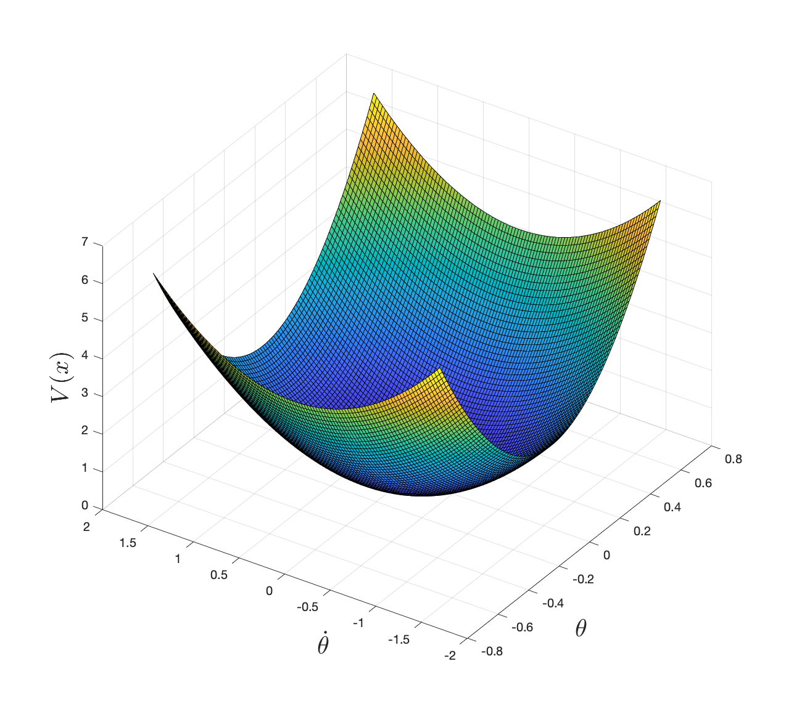
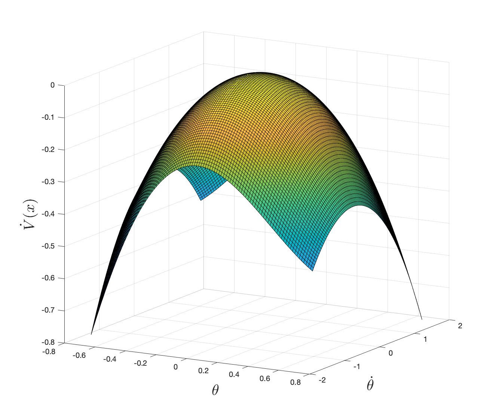

# Stability Analysis {#stability}

Optimal control formulates a control problem via the language of mathematical optimization. However, there are control problems, and sometimes even the very basic control problems, that cannot be easily stated in the optimal control formulation.

For example, suppose our goal is to _swing up a pendulum to the upright position and stabilize it there_. You may want to formalize the problem as
\begin{equation}
\min_{u(t) \in \mathbb{U}} \int_{0}^{\infty} \Vert x(t) - x_d \Vert^2 dt, \quad \text{subject to} \quad \dot{x} = f(x,u), x(0) = x_0,
(\#eq:pendulum-swingup-stability-test-1)
\end{equation}
where $x_d$ is the desired upright position for the pendulum.  However, does the solution of problem \@ref(eq:pendulum-swingup-stability-test-1), if exists, guarantee the stabilization of the pendulum at the upright position? The answer is unclear without a rigorous proof.

However, after a slight change of perspective, the optimal control problem may be formulated to better match the goal. Suppose there exists a region, $\Omega$, in the state space such that as long as the pendulum enters $\Omega$, there always exists a sequence of control to bring the pendulum to the goal state $x_d$, then we can simply formulate a different optimal control problem
\begin{equation}
\min_{u(t) \in \mathbb{U}} \int_{0}^{T} \Vert u(t) \Vert^2 dt, \quad \text{subject to} \quad x(0)=x_0, x(T) \in \Omega, \dot{x} = f(x,u),
(\#eq:pendulum-swingup-stability-test)
\end{equation}
where now it is very clear, if a solution exists to problem \@ref(eq:pendulum-swingup-stability-test), then we will definitely achieve our goal. This is because the constraint $x(T) \in \Omega$ guarantees that we will be able to stabilize the pendulum, and the cost function of \@ref(eq:pendulum-swingup-stability-test) simply encourages minimum control effort along the way. 

This highlights that, sometimes the formulation of a problem may deserve more thoughts than the actual solution. Of course the formulation \@ref(eq:pendulum-swingup-stability-test) may be much more difficult to solve. In fact, does the set $\Omega$ exist, and if so, how to describe it?

This is the main focus of this chapter: to introduce tools that can help us analyze the _stability_ of uncontrolled and controlled nonlinear systems. Specifically, we will introduce the notion of _stability certificates_, which are conditions that, if hold, certify the stability of the system (e.g., in the set $\Omega$). Interestingly, you will see that the notion of stability certificates is intuitive and easy, but what is really challenging is to _find_ and _compute_ the stability certificates. We will highlight the power and also limitation of computational tools, especially those that are based on convex optimization (see Appendix \@ref(appconvex) for a review of convex optimization).

## Autonomous Systems

Let us first focus on autonomous systems, i.e., systems whose dynamics do not depent on time (and control). We introduce different concepts of stability and ways to certify them.

### Concepts of Stability
Consider the autonomous system
\begin{equation}
\dot{x} = f(x)
(\#eq:autonomous-system)
\end{equation}
where $x \in \mathbb{X} \subseteq \mathbb{R}^n$ is the state and $f: \mathbb{R}^n \rightarrow \mathbb{R}^n$ is the (potentially nonlinear) dynamics.

Before talking about concepts of stability, we need to define an _equilibrium point_.

::: {.definitionbox}
::: {.definition #equilibriumpoint name="Equilibrium Point"}
A state $x^\star$ is called an equilibrium point of system \@ref(eq:autonomous-system) if $f(x^\star) = 0$, i.e., once the system reaches $x^\star$, it stays at $x^\star$.
:::
:::

For example, a linear system
$$
\dot{x} = A x
$$
has a single equilibrium point $x^\star = 0$ when $A$ is nonsingular, and an infinite number of equilibrium points when $A$ is singular (those equilibrium points lie in the kernel of matrix $A$).

When analyzing the behavior of a dynamical system around the equilibrium point, it is often helpful to "shift" the dynamics equation so that $0$ is the equilibrium point. For example, if we are interested in the behavior of system \@ref(eq:autonomous-system) near the equilibrium point $x^\star$, we can create a new variable
$$
z = x - x^\star,
$$
so that 
\begin{equation}
\dot{z} = \dot{x} = f(x) = f(z + x^\star).
(\#eq:shifted-system-by-equilibrium)
\end{equation}
Clearly, $z^\star = 0$ is an equilibrium point for the shifted system \@ref(eq:shifted-system-by-equilibrium).

Let us find the equilibrium points of a simple pendulum.

::: {.examplebox}
::: {.example #pendulumequilibriumpoint name="Equilibrium Points of A Simple Pendulum"}

Consider the dynamics of an uncontrolled pendulum

\begin{equation}
\begin{cases}
\dot{\theta} = \dot{\theta} \\
\ddot{\theta} = - \frac{1}{ml^2} (b \dot{\theta} + mgl \sin \theta)
\end{cases}
(\#eq:pendulum-dynamics-for-equilibrium-point)
\end{equation}
where $\theta$ is the angle between the pendulum and the vertical line, and $x = [\theta,\dot{\theta}]^T$ is the state of the pendulum ($m,g,l,b$ denote the mass, gravity constant, length, and damping constant, respectively). 

To find the equilibrium points of the pendulum, we need the right hand sides of \@ref(eq:pendulum-dynamics-for-equilibrium-point) to be equal to zero:
$$
\dot{\theta} = 0, \quad - \frac{1}{ml^2} (b \dot{\theta} + mgl \sin \theta) = 0.
$$
The solutions are easy to find
$$
x^\star = \begin{bmatrix} 0 \\ 0 \end{bmatrix} \quad \text{or} \quad \begin{bmatrix} \pi \\ 0 \end{bmatrix},
$$
corresponding to the bottomright and upright positions of the pendulum, respectively. 
:::
:::

The pendulum dynamics has two equilibrium points, but our physics intuition tells us these two equilibrium points are dramatically different. Specifically, the bottomright equilibrium $x^\star = [0,0]^T$ is such that if you perturb the pendulum around the equilibrium, the pendulum will go back to that equilibrium; the upright equilibrium $x^\star = [\pi,0]^T$ is such that if you perturb the pendulum (even just a little bit) around the equilibrium, it will diverge from that equilibrium. 

This physical intuition is exactly what we want to formalize as the concepts of stability.

In the following, we focus on the nonlinear autonomous system \@ref(eq:autonomous-system) with $f(0) = 0$, i.e., $x^\star = 0$ is an equilibrium point. We now formally define the different concepts of stability.

::: {.definitionbox}
::: {.definition #lyapunovstability name="Lyapunov Stability"}
The equilibrium point $x=0$ is said to be _stable in the sense of Lyapunov_ if, for any $R > 0$, there exists $r >0$ such that if $\Vert x(0) \Vert < r$, then $\Vert x(t) \Vert < R$ for all $t \geq 0$. Otherwise, the equilibrium point is unstable.
:::
:::

For a system that is Lyapunov stable around $x=0$, the definition says that, if we want to constrain the trajectory of the system to be within the ball $B_R = \{ x \mid \Vert x \Vert < R \}$, then we can always find a smaller ball $B_r = \{ x \mid \Vert x \Vert < r \}$ such that if the system starts within $B_r$, it will remain in the larger ball $B_R$. 

On the other hand, if the system is not Lyapunov stable at $x=0$, then there exists at least one ball $B_R$, such that no matter how close the system's initial condition is to the origin, it will eventually exit the ball $B_R$. The following exercise is left for you to verify the instability of the Van der Pol oscillator.

::: {.exercise #instabilityvanderpol name="Instability of the Van der Pol oscillator"}
Show that the Van der Pol oscillator
$$
\begin{cases}
\dot{x}_1 = x_2 \\
\dot{x}_2 = - x_1 + (1-x_1^2) x_2
\end{cases}
$$
is unstable at the equilibrium point $x = 0$.
:::

Lyapunov stability does not guarantee the system trajectory will actually converge to $x =0$. Instead, asymptotic stability will ask the system trajectory to converge to $x=0$.

::: {.definitionbox}
::: {.definition #asymptoticstability name="Asymptotic Stability and Domain of Attraction"}
The equilibrium point $x = 0$ is said to be _asymptotically stable_ if (i) it is Lyapunov stable, and (ii) there exists some $r > 0$ such that $x(0) \in B_r$ implies $x(t) \rightarrow 0$ as $t \rightarrow 0$. 

_The_ domain of attraction (for the equilibrium $x=0$) is the largest set of points in the state space such that trajectories initiated at those points will converge to the equilibrium point. That is,
$$
\Omega(x^\star) = \{ x \in \mathbb{X} \mid x(0) = x \Longrightarrow \lim_{t \rightarrow \infty} x(t) = x^\star \}.
$$
The ball $B_r$ is _a_ domain of attraction for the equilibrium point $x=0$, but not necessarily the largest domain of attraction.
:::
:::

You may immediately realize that in the definition of asymptotic stability, we require Lyapunov stability to hold first. Is this necessary? i.e., does there exist a system where trajectories eventually converge to zero, but is not stable in the sense of Lyapunov? You should work out the following exercise.

::: {.exercise #vinogradequation name="Vinograd System"}
Show that for the Vinograd dynamical system [@vinograd57-inapplicability]
$$
\begin{cases}
\dot{x} = \frac{x^2(y-x) + y^5}{(x^2+y^2)(1 + (x^2+y^2)^2)} \\
\dot{y} = \frac{y^2 (y - 2x)}{(x^2+y^2)(1 + (x^2+y^2)^2)}
\end{cases},
$$
all system trajectories converge to the equilibrium point $(x,y) = 0$, but the equilibrium point is not stable in the sense of Lyapunov.

(Hint: the system trajectories will behave like the following plot.)

```{r vinograd-system, out.width='60%', fig.show='hold', fig.cap='Trajectories of the Vinograd system. Copied from the original article of Vinograd.', fig.align='center', echo=FALSE}
knitr::include_graphics('images/vinograd.png')
```
:::

In many cases, we want the convergence of the system trajectory towards $x=0$ to be fast, thus bringing in the notion of exponential stability.

::: {.definitionbox}
::: {.definition #exponentialstability name="Exponential Stability"}

An equilibrium point $x=0$ is said to be exponentially stable, if there exists a ball $B_r$ such that as long as as $x(0) \in B_r$, then
$$
\Vert x(t) \Vert \leq \alpha \Vert x(0) \Vert e^{-\lambda t}, \quad \forall t,
$$
for some $\alpha > 0$ and $\lambda > 0$ ($\lambda$ is called the rate of exponential convergence). 
:::
:::

Exponential stability implies asymptotic stability (and certainly also Lyapunov stability). What is nice about exponential stability is that we can quantify the distance of the system trajectory to the equilibrium point as a function of time (as long as we know the constants $\alpha, \Vert x(0) \Vert, \lambda$). In many safety-critical applications, we need such performance guarantees. For example, in Chapter \@ref(state-observer), we will see the application of exponential stability in observer-feedback control.

All the concepts of stability we have mentioned so far only talk about the stability of the system _locally_ around the equilibrium point $x=0$ (via arguments like $B_r$ and $B_R$). It would be much nicer if we can guarantee stability of the system _globally_, i.e., no matter where the system starts in the state space $\mathbb{X}$, its trajectoy will converge to $x=0$.


::: {.definitionbox}
::: {.definition #globalstability name="Global Asymptotic and Exponential Stability"}

The equilibrium point $x = 0$ is said to be globally asymptotically (exponentially) stable if asymptotic (exponential) stability holds for any initial states. That is,
$$
\forall x \in \mathbb{X}, \quad x(0) = x \Longrightarrow \begin{cases}
\lim_{t \rightarrow \infty} x(t) = 0  & \text{global asymptotic stability} \\
\exists \alpha, \lambda > 0, \text{ s.t. } \Vert x(t) \Vert \leq \alpha \Vert x(0) \Vert e^{-\lambda t} & \text{global exponential stability}
\end{cases}
$$
:::
:::

This concludes our definitions of stability for nonlinear systems (Definition \@ref(def:lyapunovstability)-\@ref(def:globalstability)). It is worth mentioning that the concepts of stability are complicated (refined) here due to our focus on nonlinear systems. For linear systems, the concepts of stability are simpler. Specifically, all local stability properties of linear systems are also global and asymptotic stability is equal to exponential stability. In fact, for a linear time-invariant system $\dot{x} = Ax$, it is either asymptotically (exponentially) stable, or marginally stable, or unstable. Moreover, we can fully characterize the stability property by inspecting the eigenvalues of $A$ (you can find a refreshment of this in Appendix \@ref(app-lti-stability)). 

How do we characterize the stability property of a nonlinear system? If someone gave me a nonlinear system \@ref(eq:autonomous-system), how can I provide a certificate to her that the system is stable or unstable (I cannot use eigenvalues anymore in this case)? Let us describe some of these certificates below.

### Stability by Linearization

A natural idea is to linearize, if possible, the nonlinear system \@ref(eq:autonomous-system) at a given equilibrium point $x^\star$ and inspect the stability of the linearized system (for which we can compute eigenvalues). Therefore, the key question here is how does the stability and instability of the linearized system relate to the stability and instability of the original nonlinear system. 

::: {.theorembox}
::: {.theorem #stabilitybylinearization name="Stability by Linearization"}
Assume $x=0$ is an equilibrium point of system \@ref(eq:autonomous-system) and $f$ is continuously differentiable. Let
\begin{equation}
\dot{x} = Ax, \quad A = \frac{\partial f}{\partial x} \Big\vert_{x=0}
(\#eq:linearized-system)
\end{equation}
be the linearized system at $x=0$. The following statements are true about the stability relationship between \@ref(eq:autonomous-system) and \@ref(eq:linearized-system).

- If the linearized system \@ref(eq:linearized-system) is strictly stable (i.e., all eigenvalues of $A$ have strictly negative real parts), then the original system \@ref(eq:autonomous-system) is asymptotically stable at $x=0$.

- If the linearized system \@ref(eq:linearized-system) is unstable (i.e., at least one eigenvalue of $A$ has strictly positive real part), then the original system \@ref(eq:autonomous-system) is unstable at $x=0$.

- If the linearized system \@ref(eq:linearized-system) is marginally stable (i.e., all eigenvalues of $A$ have nonpositive real parts, and at least one eigenvalue has zero real part), then the stability of the original system \@ref(eq:autonomous-system) at $x=0$ is indeterminate.
:::
:::

Theorem \@ref(thm:stabilitybylinearization) is actually quite useful when we want to quickly examine the local stability of a nonlinear system around a given equilibrium point, as we will show in the next example.

::: {.examplebox}
::: {.example #pendulumstabilitybylinearization name="Stability of A Simple Pendulum by Linearization"}
Consider the simple pendulum dynamics \@ref(eq:pendulum-dynamics-for-equilibrium-point) in Example \@ref(exm:pendulumequilibriumpoint). Without loss of generality, let $m=1,l=1,b=0.1$. The Jacobian of the nonlinear dynamics reads
$$
A = \frac{\partial f}{\partial x} = 
\begin{bmatrix}
0 & 1 \\
-\frac{g}{l} \cos \theta & -\frac{b}{ml^2}
\end{bmatrix}.
$$

At the bottomright equilibrium point $\theta =0, \dot{\theta} = 0$, the matrix $A$ has two eigenvalues
$$
-0.0500 \pm 3.13i,
$$
and hence the pendulum is asymptotically stable at the bottomright equilibrium point.

At the upright equilibrium point $\theta =\pi, \dot{\theta} = 0$, the matrix $A$ has two eigenvalues 
$$
3.08, \quad -3.18,
$$
and hence the pendulum is unstable at the upright equilibrium point.
:::
:::

The linearization method is easy to carry out. However, it tells us nothing about global stability or exponential stability. Moreover, when the linearized system is marginally stable, the stability of the orignal system is inconclusive. In the next, we will introduce a more general, and perhaps the most popular framework for analyzing the stability of nonliear systems.

### Lyapunov Analysis

The basic idea of Lyapunov analysis is quite intuitive: if can find an "energy-like" scalar functin for a system such that the scalar function is zero at an equilibrium point and positive everywhere else, and the time-derivative of the scalar function is zero at the equilibrium point but negative otherwise, then we know that the energy of the system will eventually converge to zero, and hence the state trajectory will converge to the equilibrium point. Lyapunov analysis was originally inspired by the energy function of a mechanical system: the total energy of a mechanical system (potental energy plus kinetic energy) will settle down to its minimum value if it is constantly dissipated (e.g., due to damping). However, the concept of a Lyapunov function is much broader than the energy function, i.e., it can be an arbitrary abstract function without any physical meaning. 

Let us now introduce the concept of a Lyapunov function.

::: {.definitionbox}
::: {.definition #positivedefinitefunction name="Positive Definite Function"}
A scalar function $V(x)$ is said to be locally positive definite in a ball $B_R$ if
$$
V(0) = 0 \quad \text{and} \quad V(x) > 0, \forall x \in B_R \backslash \{0\},
$$
and globally positive definite if 
$$
V(0) = 0 \quad \text{and} \quad V(x) > 0, \forall x \in \mathbb{X} \backslash \{0\},
$$
where $\mathbb{X}$ is the entire state space.

A function $V(x)$ is said to be negative definite if $-V(x)$ is positive definite.

A function $V(x)$ is said to be positive semidefinite if the "$>$" sign is replaced by the "$\geq$" sign in the above equations.

A function $V(x)$ is said to be negative semidefinite if $-V(x)$ is positive semidefinite.
:::
:::

For example, when $\mathbb{X} = \mathbb{R}^2$, the function $V(x) = x_1^2 + x_2^2$ is positive definite, but the function $V(x) = x_1^2$ is only positive semidefinite.

::: {.definitionbox}
::: {.definition #lyapunovfunction name="Lyapunov Function"}
In the ball $B_R$, if a function $V(x)$ is positive definite, and its time derivative along any system trajectory
$$
\dot{V}(x) = \frac{\partial V}{\partial x} f(x)
$$
is negative semidefinite (we assume the partial derivative $\frac{\partial f}{\partial x}$ exists and is continuous), then $V(x)$ is said to be a Lyapunov function for system \@ref(eq:autonomous-system). Note that $\dot{V}(x^\star) = 0$ at any equilibrium point $x^\star$ by definition.
:::
:::

With the introduction of positive definite and Lyapunov functions, we are now ready to use them to certify different concepts of stability.

::: {.theorembox}
::: {.theorem #lyapunovlocalstability name="Lyapunov Local Stability"}
Consider the nonlinear system \@ref(eq:autonomous-system) in a ball $B_R$ with equilibrium point $x=0$, if there exists a scalar function $V(x)$ (with continuous partial derivatives) such that 

- $V(x)$ is positive definite (in $B_R$)

- $\dot{V}(x)$ is negative semidefinite (in $B_R$)

then the equilibrium point $x=0$ is stable in the sense of Lyapunov (cf. Definition \@ref(def:lyapunovstability)). 

Moreover, 

- if $\dot{V}(x)$ is negative definite in $B_R$, then the equilibrium point is asymptotically stable (cf. Definition \@ref(def:asymptoticstability)).

- if $\dot{V}(x) \leq - \alpha V(x)$ for any $x \in B_R$, then the equilibrium point is exponentially stable (cf. Definition \@ref(def:exponentialstability)). 
:::
:::

Let us apply Theorem \@ref(thm:lyapunovlocalstability) to the simple pendulum.

::: {.examplebox}
::: {.example #lyapunovlocalstabilitypendulum name="Lyapunov Local Stability for A Simple Pendulum"}
Consider the pendulum dynamics \@ref(eq:pendulum-dynamics-for-equilibrium-point). The total energy of a pendulum is
\begin{equation}
V(x) = \frac{1}{2} ml^2 \dot{\theta}^2 + mgl (1 - \cos \theta).
(\#eq:pendulum-lyapunov-1)
\end{equation}
Clearly, $V(x)$ is positive definite on the entire state space, and the only point where $V(x) = 0$ is the equilibrium point $\theta = 0, \dot{\theta} = 0$.

Let us compute the time derivative of $V(x)$:
$$
\dot{V}(x) = ml^2 \dot{\theta} \ddot{\theta} + mgl \sin \theta \dot{\theta} = ml^2 \dot{\theta} \left( -\frac{1}{ml^2}(b \dot{\theta} + mgl \sin\theta)  \right) + mgl \sin \theta \dot{\theta} = -b \dot{\theta}^2 ,
$$
which is clearly negative semidefinite. In fact, $\dot{V}(x)$ is precisely the energy dissipation rate due to damping. By Theorem \@ref(thm:lyapunovlocalstability) we conclude that the equilibrium point is stable in the sense of Lyapunov.

Note that with this choice of $V(x)$ as in \@ref(eq:pendulum-lyapunov-1), we actually cannot certify asymptotic local stability of the bottomright equilibrium point. So a natural question is, can we find a better Lyapunov function that indeed certifies asymptotic stability?

The answer is yes. Consider a different Lyapunov function
\begin{equation}
\tilde{V}(x) = \frac{1}{2} ml^2 \dot{\theta}^2 + \frac{1}{2} ml^2 \left( \frac{b}{ml^2}\theta + \dot{\theta} \right)^2 + 2mgl (1 - \cos \theta),
(\#eq:pendulum-lyapunov-2)
\end{equation}
which is positive definite and admits a single zero-value point $\theta = 0, \dot{\theta} = 0$ that is also the bottomright equilibrium point. Simplifying $\tilde{V}(x)$ we can get 
\begin{align}
\tilde{V}(x) &= ml^2 \dot{\theta}^2 + 2mgl(1-\cos \theta) + \frac{1}{2} ml^2 \left( \frac{b^2}{m^2 l^4} \theta^2 + \frac{2b}{ml^2} \theta \dot{\theta} \right) \\
&= 2V(x) + \frac{1}{2} ml^2 \left( \frac{b^2}{m^2 l^4} \theta^2 + \frac{2b}{ml^2} \theta \dot{\theta} \right).
\end{align}

The time derivative of the new function $\tilde{V}(x)$ is
\begin{align}
\dot{\tilde{V}}(x) &= 2 \dot{V}(x) + \frac{ml^2}{2} \left( \frac{2b^2}{m^2 l^4} \theta \dot{\theta} + \frac{2b}{ml^2} (\dot{\theta}^2 + \theta \ddot{\theta})  \right) \\
& = 2\dot{V}(x) + b\dot{\theta}^2 + \left( \frac{b^2}{ml^2} \theta\dot{\theta} + b \theta \left( -\frac{1}{ml^2} (b\dot{\theta} + mgl \sin \theta) \right) \right) \\
& = -b \left( \dot{\theta}^2 + \frac{g}{l} \theta \sin \theta \right).
\end{align}
$\dot{\tilde{V}}(x)$ is negative definite locally around the equilibrium point (locally $\sin\theta \approx \theta$). Therefore, with the new Lyapunov function $\tilde{V}(x)$ we can certify asymptotic stability.

Interestingly, $V(x)$ is intuitive (the total energy of the pendulum system), but it fails to certify asymptotic local stability (as least by just using Theorem \@ref(thm:lyapunovlocalstability)). $\tilde{V}(x)$ does not have any physical intuition, but it successfully certifies local asymptotic stability.

In Section \@ref(invariant-set-theorem), we will see that when using $V(x)$ with the invariant set theorem, we can actually still certify the asymptotic stability of the pendulum around the bottomright equilibrium.
:::
:::

In many applications, we desire to certify the global stability of an equilibrium point. The following theorem states that if in addition the scalar function $V(x)$ is _radially unbounded_, then global stability can be certified. 

::: {.theorembox}
::: {.theorem #lyapunovglobalstability name="Lyapunov Global Stability"}
For the autonomous system \@ref(eq:autonomous-system), suppose there exists a scalar function $V(x)$ with (continuous partial derivatives) such that 

- $V(x)$ is positive define;

- $\dot{V}(x)$ is negative define;

- $V(x) \rightarrow \infty$ as $\Vert x \Vert \rightarrow \infty$,

then the equilibrium point $x = 0$ is globally asymptotically stable (cf. Definition \@ref(def:globalstability)).

Moreover, if in addition to the three conditions above

- $\dot{V}(x) \leq - \alpha V(x)$ for some $\alpha > 0$, then the equilibrium point is globally exponentially stable.
:::
:::


### Invariant Set Theorem {#invariant-set-theorem}

Through Theorem \@ref(thm:lyapunovlocalstability), Theorem \@ref(thm:lyapunovglobalstability), and Example \@ref(exm:lyapunovlocalstabilitypendulum), we see that in order to certify asymptotic stability, the time derivative $\dot{V}(x)$ is required to be positive definite. However, in many cases, with Example \@ref(exm:lyapunovlocalstabilitypendulum) being a typical one, $\dot{V}(x)$ is only negative semidefinite, which makes it difficult to certify asymptotic stability. 

In this section, we will introduce the invariant set theorem that can help us reason about asymptotic stability even when $\dot{V}(x)$ is only negative semidefinite. 

Let us first introduce the notion of an invariant set.

::: {.definitionbox}
::: {.definition #invariantset name="Invariant Set"}
A set $G$ is an invariant set for a dynamical system \@ref(eq:autonomous-system) if every system trajectory that starts within $G$ remains in $G$ for all future time. Formally,
$$
x(0) \in G \Longrightarrow x(t) \in G,\forall t.
$$
:::
:::

A trivial invariant set if the entire state space $\mathbb{X}$. Another example of an invariant set is the singleton $\{x^\star \}$ with $x^\star$ being an equilibrium point. A nontrivial invariant set is the domain of attraction of an equilibrium point (cf. Definition \@ref(def:asymptoticstability)).

We now state the local invariant set theorem.

::: {.theorembox}
::: {.theorem #localinvariantsettheorm name="Local Invariant Set"}
Consider the autonomous system \@ref(eq:autonomous-system), and let $V(x)$ be a scalar function with continuous partial derivatives. Assume that

- the sublevel set $\Omega_{\rho} = \{ x \in \mathbb{X} \mid V(x) < \rho \}$ is bounded for some $\rho > 0$, and 

- $V(x) \leq 0$ for all $x \in \Omega_{\rho}$.

Let $\mathcal{R}$ be the set of all points within $\Omega_{\rho}$ such that $\dot{V}(x) = 0$, and $\mathcal{M}$ be the largest invariant set in $\mathcal{R}$. Then, every trajectory that starts in $\Omega_{\rho}$ will converge to $\mathcal{M}$ as $t \rightarrow \infty$.
:::
:::

With this theorem, we can now revisit the pendulum example \@ref(exm:lyapunovlocalstabilitypendulum).

::: {.examplebox}
::: {.example #pendulumlocalstabilitybyinvariantset name="Revisiting the Local Stability of A Simple Pendulum"}
In Example \@ref(exm:lyapunovlocalstabilitypendulum), using the Lyapunov function 
$$
V(x) = \frac{1}{2} ml^2 \dot{\theta}^2 + mgl(1 - \cos\theta),
$$
with time derivative
$$
\dot{V}(x) = -b\dot{\theta}^2,
$$
we were only able to verify the stability of the bottomright equilibrium point in the sense of Lyapunov.

Now let us use the invariant set theorem \@ref(thm:localinvariantsettheorm) to show the asymptotic stability of the bottomright equilibrium point.

First it is easy to see that the sublevel set of $V(x)$ is bounded. For example, with $\rho = \frac{1}{4} mgl$,
\begin{align}
V(x) < \frac{1}{4} mgl \Rightarrow \frac{1}{2} ml^2 \dot{\theta}^2 < \frac{1}{4} mgl \Rightarrow \dot{\theta}^2 < \frac{1}{2} \frac{g}{l} \\
V(x) < \frac{1}{4} mgl \Rightarrow mgl(1-\cos\theta) < \frac{1}{4} mgl \Rightarrow \cos\theta > \frac{3}{4} \Rightarrow \theta \in (-\arccos \frac{3}{4}, \arccos \frac{3}{4}).
\end{align}

The set $\mathcal{R}$, including all the points in $\Omega_{\rho}$ such that $\dot{V}(x) = 0$ is 
$$
\mathcal{R} = \{ x \in \Omega_{\rho} \mid \dot{\theta} = 0 \}.
$$
We now claim that the largest invariant set $\mathcal{M}$ in $\mathcal{R}$ is just the single equilibrium point $x = [0,0]^T$. We can prove this by contradiction. Suppose there is a different point $x' = [\theta,0]^T$ with $\theta \neq 0$ also belonging to the invariant set $\mathcal{M}$, then 
$$
\ddot{\theta} = -\frac{1}{ml^2} (b \dot{\theta} + mgl \sin \theta) = - \frac{g}{l} \sin\theta \neq 0,
$$
which means $\dot{\theta}$ will immediately become nonzero, and hence the trajectory will exit $\mathcal{R}$ and also $\mathcal{M}$. So that point cannot belong to the invariant set. 

Now by Theorem \@ref(thm:localinvariantsettheorm), we conclude the bottomright equilibrium point is asymptotically stable.

Note that through this analysis we also obtain $\Omega_{\rho}$ as a domain of attraction for the bottomright equilibrium point.
:::
:::

Similarly, with the addition of the radial unboundedness of $V(x)$, we have a global version of the invariant set theorem.

::: {.theorembox}
::: {.theorem #globalinvariantsettheorem name="Global Invariant Set"}
For the autonomous system \@ref(eq:autonomous-system), let $V(x)$ be a scalar function with continuous partial derivatives that satisfies

- $V(x) \rightarrow \infty$ as $\Vert x \Vert \rightarrow \infty$, and 

- $\dot{V}(x) \leq 0$ over the entire state space.

Let $\mathcal{R} = \{ x\in \mathbb{X} \mid \dot{V}(x)= 0 \}$, and $\mathcal{M}$ be the largest invariant set in $\mathcal{R}$. Then all system trajectories asymptotically converge to $\mathcal{M}$ as $t \rightarrow \infty$.
:::
:::

### Computing Lyapunov Certificates 

All the Theorems we have stated so far (Theorems \@ref(thm:lyapunovlocalstability), \@ref(thm:lyapunovglobalstability), \@ref(thm:localinvariantsettheorm), and \@ref(thm:globalinvariantsettheorem)) are very general and powerful tools for certifying stability of nonlinear systems. However, the key requirement for applying the results is a Lyapunov function $V(x)$ that verifies different types of nonnegativity constraints. 

How to find these functions?

In Example \@ref(exm:lyapunovlocalstabilitypendulum), we have seen that physical intuition can help us find a good Lyapunov function \@ref(eq:pendulum-lyapunov-1). Nevertheless, it did not quite give us what we want in terms of asymptotic stability. Instead, a hand-crafted function \@ref(eq:pendulum-lyapunov-2) helped us certify local asymptotic stability. 

Wouldn't it be cool that we can design an algorithm to find the Lyapunov certificates for us?

A closer look at the Theorems \@ref(thm:lyapunovlocalstability), \@ref(thm:lyapunovglobalstability), \@ref(thm:localinvariantsettheorm), and \@ref(thm:globalinvariantsettheorem) tells us the key property of a Lyapunov certificate is that it needs to satisfy the positivity (or negativity) constraint for all states inside a set. This is a nontrivial and difficult requirement, because even if we were given a function $V(x)$, naively evaluting if $V(x)$ is nonnegative inside a set requires enumeration over all the states in the set, which is impractical given that the set is continuous and has infinite number of states.^[In fact, many of the recent works verify "neural" Lyapunov certificates (and other types of certificates) using this idea, see for example [@dawson23tro-safe].]

In the next, I want to introduce a general framework for searching Lyapunov certificates that is based on convex optimization.

This framework, although having deep connections with many other disciplines such as algebraic geometry, theoretical computer science, and mathematical optimization, is based on a very simple intution that we all have since high school.

Suppose I give you a polynomial of a single variable
$$
p(x) = x^2 + 2x + 1
$$
and ask you if $p(x) \geq 0$ for all $x \in \mathbb{R}$. You would not hesitate to answer "yes", because you know 
$$
p(x) = (x+1)^2 
$$
is the square of $x+1$ and hence must be nonnegative. 

Let's make it more challenging. Suppose I give you a polynomial
$$
p(x) = -x^4 + 2 x^2 + x + 1
$$
and ask you if $p(x)$ is nonnegative for any $x \in [-1,1]$. Now it becomes much harder to answer this question because (i) we have a constraint set $x \in [-1,1]$, and (ii) the polynomial $p(x)$ has a higher degree and it is not a polynomial that we are very famliar with (compared to $p(x) = x^2 + 2x +1$).

However, if I show you that $p(x)$ can be written as 
$$
p(x) = (x+1)^2 + x^2 (1 - x^2) = -x^4 + 2 x^2 + 2x + 1,
$$
it becomes easy again to say that $p(x)$ is nonnegative for any $x \in [-1,1]$. Why?

1. First notice that $(x+1)^2 \geq 0$ for any $x \in \mathbb{R}$, 

2. Then notice that $1 - x^2 \geq 0$ for any $x \in [-1,1]$, and $x^2 \geq 0$ for any $x$. Therefore, $x^2 (1-x^2) \geq 0$ for any $x \in [-1,1]$. 

Combining the above two reasonings, it becomes clear $p(x)$ is nonnegative for any $x \in [-1,1]$.

With this simple intuition, let me now give a short tutorial on sum of squares (SOS).

::: {.theorembox}
<p style="text-align: center;">Positivstellensatz, Sum of Squares, and Convex Optimization</p>

Let $x = [x_1,\dots,x_n] \in \mathbb{R}^n$ be a list of variables, we define a _basic semialgebraic set_ as 
\begin{equation}
\mathcal{X} = \{ x \in \mathbb{R}^{n} \mid p_i(x) = 0, i = 1,\dots,l_{\mathrm{eq}}; p_i(x) \geq 0, i=l_{\mathrm{eq}}+1,\dots,l_{\mathrm{eq}} + l_{\mathrm{ineq}} \}
(\#eq:basic-semialgebraic-set)
\end{equation}
where $p_i(x),i=1,\dots,l_{\mathrm{eq}}+l_{\mathrm{ineq}}$ are polynomial functions in $x$. In other words, the set $\mathcal{X}$ is a subset of $\mathbb{R}^n$ that is defined by $l_{\mathrm{eq}}$ equality constraints and $l_{\mathrm{ineq}}$ inequality constraints. 

Observe that a basic semialgebraic set can capture a lot of the common constraint sets, such as a unit sphere, a unit ball, and a box (try this for yourself).

We are now given the same question. Suppose I give you another polynomial function $p_0(x)$, how can you tell me if $p_0(x)$ is nonnegative for any $x$ in the basic semialgebraic set? That is, to verify if
$$
p_0(x) \geq 0, \quad \forall x \in \mathcal{X}.
$$

Using the intution above, you will say if I can produce a decomposition of $p_0(x)$ as
\begin{equation}
p_0(x) = \sigma_0(x) + \sum_{i=1}^{l_{\mathrm{ineq}}} \sigma_i(x) p_{i + l_{\mathrm{eq}}}(x) + \sum_{i=1}^{l_{\mathrm{eq}}} \lambda_i(x) p_{i}(x),
(\#eq:p-satz-putinar)
\end{equation}
where $\sigma_0,\sigma_1,\dots,\sigma_{l_{\mathrm{ineq}}}$ are "some type of" polynomials that we know are always nonnegative (for any $x \in \mathbb{R}^n$), and $\lambda_1,\dots,\lambda_{l_{\mathrm{eq}}}$ are arbitrary polynomials. Then I have a "certificate" that $p_0(x) \geq 0$ for any $x \in \mathcal{X}$.

Why? The reasoning is exactly the same as before.

1. $\sigma_0(x) \geq 0$ for any $x$,

2. $\sigma_i(x) p_{i+l_{\mathrm{eq}}}(x) \geq 0, i=1,\dots,l_{\mathrm{ineq}}$ for any $x \in \mathcal{X}$, because (a) $\sigma_i(x) \geq 0$ for any $x$, and (b) $p_{i+l_{\mathrm{eq}}}(x) \geq 0$ for any $x \in \mathcal{X}$ by definition of the basic semialgebraic set \@ref(eq:basic-semialgebraic-set), 

3. $\lambda_i(x) p_i (x) = 0, i=1,\dots,l_{\mathrm{eq}}$ by definition of the basic semialgebraic set \@ref(eq:basic-semialgebraic-set).

Now it comes the key question: what type of polynomials do we know is always nonnegative? 

A natural choice is a "sum-of-squares" (SOS) polynomial. 

::: {.definitionbox}
::: {.definition #sumofsquarespolynomial name="Sum-of-Squares Polynomial"}
A polynomial $\sigma(x)$ is called an SOS polynomial if 
$$
\sigma(x) = \sum_{i=1}^k q_i^2(x),
$$
i.e., $\sigma(x)$ can be written as a sum of $k$ squared polynomials. 
:::
:::

Not only is this a natural choice, it turns out that an SOS polynomial also has a nice connection with positive semidefinite (PSD) matrices. In fact, a polynomial $\sigma(x)$ is SOS if and only if 
$$
\sigma(x) = [x]_d^T Q [x]_d
$$
for some $Q \succeq 0$, where $[x]_d$ is the vector of monomials in $x$ of degree up to $d$. For example, if $x \in \mathbb{R}^2$ and $d = 2$, then 
$$
[x]_2 = [1,x_1,x_2,x_1^2,x_1x_2,x_2^2]^T.
$$
With this choice of $\sigma(x)$ as SOS polynomials, we can now formulate a problem that explicitly searches for a certificate in the form of \@ref(eq:p-satz-putinar):
\begin{align}
\text{find} &  \quad \{\sigma_i \}_{i=0}^{l_{\mathrm{ineq}}}, \{ \lambda_i \}_{i=1}^{l_{\mathrm{eq}}} \\
\text{subject to} & \quad 
p_0(x) = \sigma_0(x) + \sum_{i=1}^{l_{\mathrm{ineq}}} \sigma_i(x) p_{i + l_{\mathrm{eq}}}(x) + \sum_{i=1}^{l_{\mathrm{eq}}} \lambda_i(x) p_{i}(x), \\
& \quad \sigma_i \text{ is SOS}, i=0,\dots,l_{\mathrm{ineq}}, \\
& \quad \lambda_i \text{ is polynomial}, i=1,\dots,l_{\mathrm{eq}}.
\end{align}


:::


::: {.examplebox}
::: {.example #lyapunovlocalstabilitypendulumsos name="Computing Lyapunov Local Stability Certificate for the Simple Pendulum with Convex Optimization"}
We first write the pendulum dynamics in polynomial form via a change of coordinate $x = [\mathfrak{s}, \mathfrak{c}, \dot{\theta}]^T$ with $\mathfrak{s} = \sin \theta$, $\mathfrak{c} = \cos\theta$:
$$
\begin{cases}
\dot{\mathfrak{s}} = \mathfrak{c} \dot{\theta} \\
\dot{\mathfrak{c}} = -\mathfrak{s} \dot{\theta} \\
\ddot{\theta} = - \frac{1}{ml^2}(b \dot{\theta} + mgl \mathfrak{s})
\end{cases}.
$$
We will use $m = 1, l = 1, b=0.1$ for our numerical experiment.

We want to find a local Lyapunov certificate in the compact set
\begin{equation}
\theta \in \left[-\arccos \frac{3}{4}, \arccos \frac{3}{4} \right], \quad \dot{\theta} \in \left[- \frac{\pi}{2}, \frac{\pi}{2} \right].
(\#eq:lyapunovlocalstabilitypendulumsos-constraintset)
\end{equation}

In the new coordinates $x$, this is equivalent to the semialgebraic set
$$
\mathcal{X} = \left\{ x \in \mathbb{R}^{3} \mid \mathfrak{s}^2 + \mathfrak{c}^2 = 1, \dot{\theta}^2 \leq \frac{\pi^2}{4}, \mathfrak{c} \geq \frac{3}{4}  \right\}.
$$

Denoting the bottomright equilibrium point as $x_e = [0,1,0]^T$, and with $\epsilon_1,\epsilon_2 > 0$ two positive constants, we can seek a Lyapunov function $V(x)$ that satisfies the following conditions 
\begin{align}
V(x) \geq \epsilon_1 (x - x_e)^T (x - x_e), \quad \forall x \in \mathcal{X} (\#eq:lyapunovlocalstabilitypendulumsos-1)\\
\dot{V}(x) = \frac{\partial V}{\partial x} \dot{x} \leq - \epsilon_2 (x - x_e)^T (x - x_e), \quad \forall x \in \mathcal{X} (\#eq:lyapunovlocalstabilitypendulumsos-2)\\
V(x_e) = 0, \quad \dot{V}(x_e) = 0 (\#eq:lyapunovlocalstabilitypendulumsos-3)
\end{align}
where \@ref(eq:lyapunovlocalstabilitypendulumsos-1) ensures $V(x)$ is positive definite, \@ref(eq:lyapunovlocalstabilitypendulumsos-2) ensures $\dot{V}(x)$ is negative definite, and \@ref(eq:lyapunovlocalstabilitypendulumsos-3) ensures $V(x),\dot{V}(x)$ vanish at the equilibrium point. 

To leverage the power of convex optimization, we can relax the positivity constraints as SOS constraints
\begin{align}
V(x) - \epsilon_1 (x - x_e)^T (x - x_e) \quad \text{is SOS on} \quad \mathcal{X} \\
- \epsilon_2 (x - x_e)^T (x - x_e) - \frac{\partial V}{\partial x} \dot{x}\quad \text{is SOS on} \quad \mathcal{X} \\
V(x_e) = 0, \quad \dot{V}(x_e) = 0.
\end{align}

If we limit the degree of $V$ to $2$, choose the relaxation order $\kappa = 2$, and $\epsilon_1 = \epsilon_2 = 0.01$, we obtain a solution
$$
V(x) = 2.7982 \mathfrak{s}^2 + 0.086248 \mathfrak{s} \dot{\theta} + 2.4548\mathfrak{c}^2 + 0.88117 \dot{\theta}^2 - 16.6277 \mathfrak{c} + 14.1728
$$
with the time derivative
$$
\dot{V}(x) = 0.68675 \mathfrak{s} \mathfrak{c} \dot{\theta} + 0.086248* \mathfrak{c} \dot{\theta}^2 - 0.84523 \mathfrak{s}^2 - 0.65191 \mathfrak{s} \dot{\theta} - 0.17623 \dot{\theta}^2.
$$

Plotting $V(x)$ in the constraint set \@ref(eq:lyapunovlocalstabilitypendulumsos-constraintset) using $(\theta, \dot{\theta})$ coordinates, we get
```{r lyapunov-local-certificate-pendulum-V, out.width='60%', fig.show='hold', fig.cap='Lyapunov local stability certificate computed via convex optimization.', fig.align='center', echo=FALSE}

```
and verify that $V(x)$ is locally positive definite.

Plotting $\dot{V}(x)$ in the constraint set \@ref(eq:lyapunovlocalstabilitypendulumsos-constraintset) using $(\theta, \dot{\theta})$ coordinates, we get
```{r lyapunov-local-certificate-pendulum-Vdot, out.width='60%', fig.show='hold', fig.cap='Derivative of the lyapunov local stability certificate computed via convex optimization.', fig.align='center', echo=FALSE}

```
and verify that $\dot{V}(x)$ is locally negative definite.

You should try the code for this example [here](https://github.com/ComputationalRobotics/OptimalControlEstimation-Examples/blob/main/pendulum_local_lyapunov_certificate.m).

:::
:::

## Controlled Systems


## Non-autonomous Systems

::: {.lemma #Barbalat name="Barbalat's Lemma"}
Let $f(t)$ be differentiable, if 

- $\lim_{t \rightarrow \infty} f(t)$ is finite, and  

- $\dot{f}(t)$ is uniformly continuous,^[A sufficient condition for this to hold is that $\ddot{f}$ exists and is bounded.]

then 
$$
\lim_{t \rightarrow \infty} \dot{f}(t) = 0.
$$
:::

::: {.theorembox}
::: {.theorem #BarbalatStability name="Barbalat's Stability Certificate"}
If a scalar function $V(x,t)$ satisfies

- $V(x,t)$ is lower bounded,

- $\dot{V}(x,t)$ is negative semidefinite 

- $\dot{V}(x,t)$ is uniformly continuous

then $\dot{V}(x,t) \rightarrow 0$ as $t \rightarrow \infty$.
:::
:::
::: {.proofbox}
::: {.proof}
$V(x,t)$ is lower bounded and $\dot{V}$ is negative semidefinite implies the limit of $V$ as $t \rightarrow \infty$ is finite (note that $V(x,t) \leq V(x(0),0)$). Then the theorem clearly follows from Barbalat's Lemma \@ref(lem:Barbalat).
:::
:::

